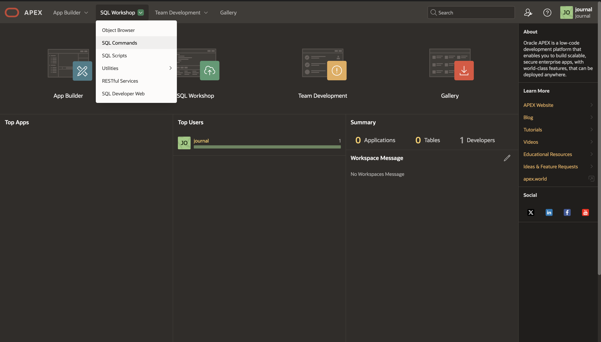
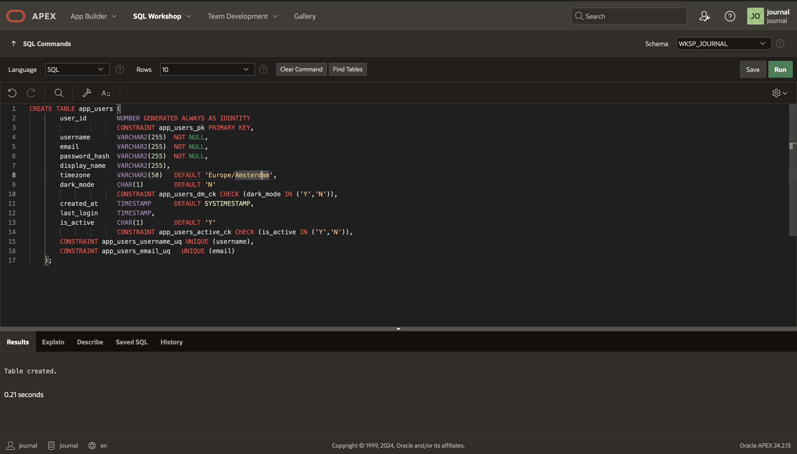
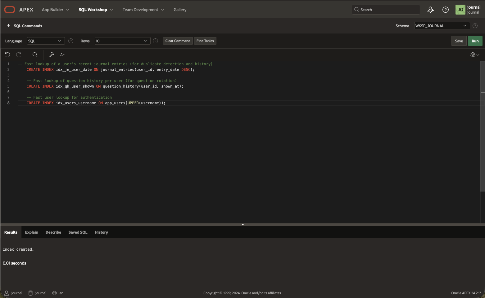
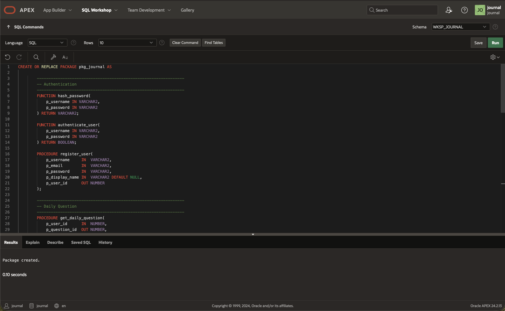
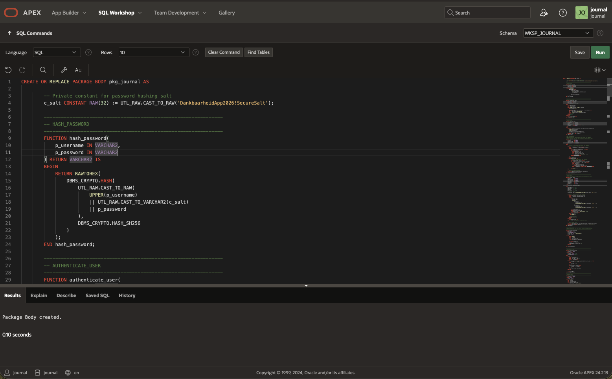
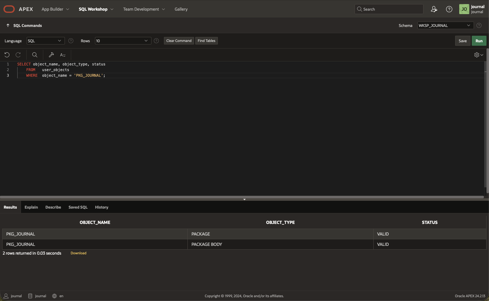
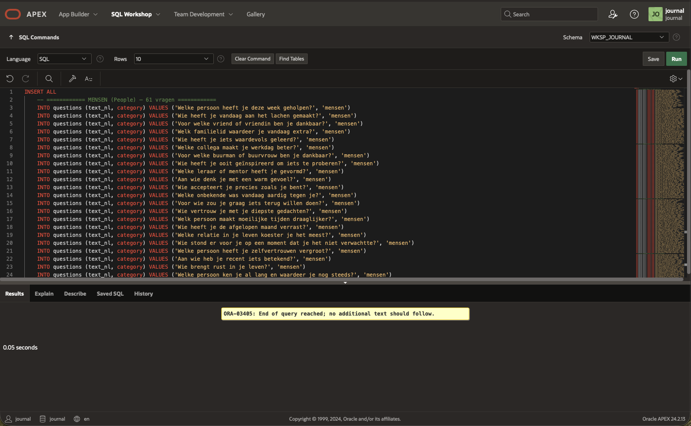
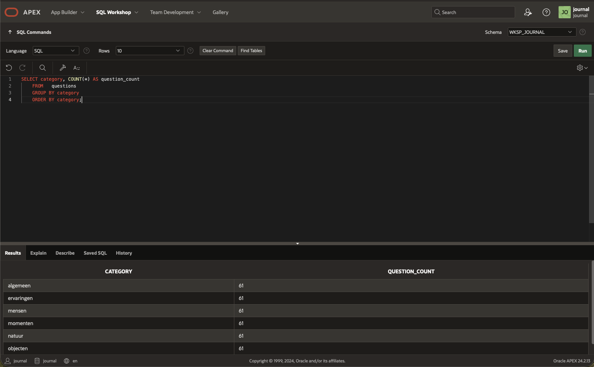
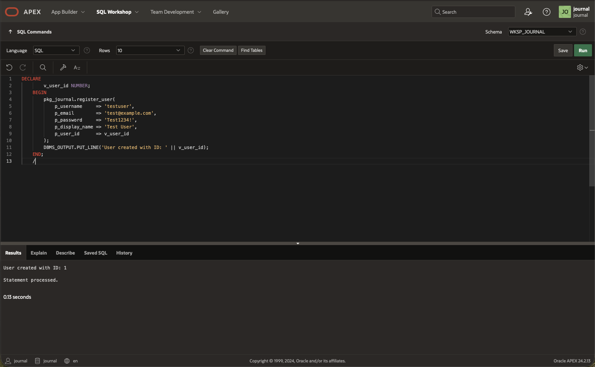
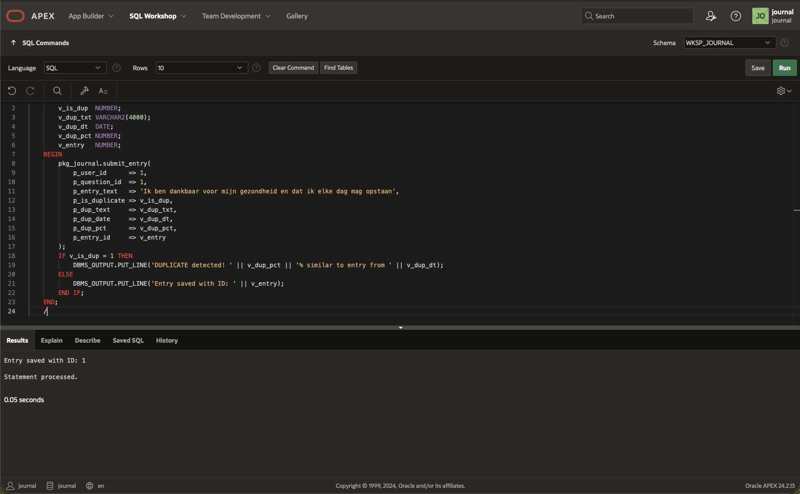

# Lab 2: Create the Database Schema

## Introduction

In this lab, you will create the database schema for the gratitude journal app. This includes user management tables, the questions pool, journal entries with a one-per-day constraint, question rotation history, and a comprehensive PL/SQL package for all business logic. You'll also seed 100 Dutch gratitude questions across six categories.

Estimated Time: 25 minutes

### Objectives

In this lab, you will:
- Create all database tables with proper constraints and indexes
- Build a PL/SQL package with authentication, journal entry, streak, and question rotation logic
- Seed 365 Dutch gratitude questions across six categories
- Verify the schema works correctly

### Prerequisites

This lab assumes you have:
- Completed Lab 1 (Autonomous Database with APEX workspace ready)
- Access to SQL Workshop → SQL Commands in your APEX workspace

## Task 1: Create the Core Tables

1. Navigate to **SQL Workshop** → **SQL Commands** in your APEX workspace.

    

2. Run the following SQL to create the `APP_USERS` table for custom authentication:

    ```sql
    CREATE TABLE app_users (
        user_id        NUMBER GENERATED ALWAYS AS IDENTITY
                       CONSTRAINT app_users_pk PRIMARY KEY,
        username       VARCHAR2(255)  NOT NULL,
        email          VARCHAR2(255)  NOT NULL,
        password_hash  VARCHAR2(255)  NOT NULL,
        display_name   VARCHAR2(255),
        timezone       VARCHAR2(50)   DEFAULT 'Europe/Amsterdam',
        dark_mode      CHAR(1)        DEFAULT 'N'
                       CONSTRAINT app_users_dm_ck CHECK (dark_mode IN ('Y','N')),
        created_at     TIMESTAMP      DEFAULT SYSTIMESTAMP,
        last_login     TIMESTAMP,
        is_active      CHAR(1)        DEFAULT 'Y'
                       CONSTRAINT app_users_active_ck CHECK (is_active IN ('Y','N')),
        CONSTRAINT app_users_username_uq UNIQUE (username),
        CONSTRAINT app_users_email_uq   UNIQUE (email)
    );
    ```

    

3. Run the following SQL to create the `QUESTIONS` table:

    ```sql
    CREATE TABLE questions (
        question_id    NUMBER GENERATED ALWAYS AS IDENTITY
                       CONSTRAINT questions_pk PRIMARY KEY,
        text_nl        VARCHAR2(500)  NOT NULL,
        category       VARCHAR2(50)   NOT NULL
                       CONSTRAINT questions_cat_ck CHECK (
                           category IN ('mensen','momenten','objecten','ervaringen','natuur','algemeen')
                       ),
        created_at     TIMESTAMP      DEFAULT SYSTIMESTAMP
    );
    ```

4. Run the following SQL to create the `JOURNAL_ENTRIES` table. This is the heart of the app — note the one-entry-per-user-per-day constraint and minimum length check:

    ```sql
    CREATE TABLE journal_entries (
        entry_id       NUMBER GENERATED ALWAYS AS IDENTITY
                       CONSTRAINT journal_entries_pk PRIMARY KEY,
        user_id        NUMBER         NOT NULL
                       CONSTRAINT je_user_fk REFERENCES app_users(user_id) ON DELETE CASCADE,
        question_id    NUMBER         NOT NULL
                       CONSTRAINT je_question_fk REFERENCES questions(question_id),
        entry_text     VARCHAR2(4000) NOT NULL,
        entry_date     DATE           DEFAULT TRUNC(SYSDATE),
        created_at     TIMESTAMP      DEFAULT SYSTIMESTAMP,
        CONSTRAINT je_min_length_ck CHECK (LENGTH(TRIM(entry_text)) >= 10),
        CONSTRAINT je_one_per_day_uq UNIQUE (user_id, entry_date)
    );
    ```

5. Run the following SQL to create the `QUESTION_HISTORY` table that tracks which questions each user has seen:

    ```sql
    CREATE TABLE question_history (
        history_id     NUMBER GENERATED ALWAYS AS IDENTITY
                       CONSTRAINT question_history_pk PRIMARY KEY,
        user_id        NUMBER         NOT NULL
                       CONSTRAINT qh_user_fk REFERENCES app_users(user_id) ON DELETE CASCADE,
        question_id    NUMBER         NOT NULL
                       CONSTRAINT qh_question_fk REFERENCES questions(question_id),
        shown_at       TIMESTAMP      DEFAULT SYSTIMESTAMP
    );
    ```

## Task 2: Create Indexes for Performance

1. Run the following SQL to create indexes that optimize the most common queries:

    ```sql
    -- Fast lookup of a user's recent journal entries (for duplicate detection and history)
    CREATE INDEX idx_je_user_date ON journal_entries(user_id, entry_date DESC);

    -- Fast lookup of question history per user (for question rotation)
    CREATE INDEX idx_qh_user_shown ON question_history(user_id, shown_at);

    -- Fast user lookup for authentication
    CREATE INDEX idx_users_username ON app_users(UPPER(username));
    ```

    

## Task 3: Create the PL/SQL Package

The `PKG_JOURNAL` package encapsulates all business logic: authentication, password hashing, user registration, daily question rotation, journal entry submission with duplicate detection, and streak calculation.

1. Run the following SQL to create the **package specification**:

    ```sql
    CREATE OR REPLACE PACKAGE pkg_journal AS

        ---------------------------------------------------------------
        -- Authentication
        ---------------------------------------------------------------
        FUNCTION hash_password(
            p_username IN VARCHAR2,
            p_password IN VARCHAR2
        ) RETURN VARCHAR2;

        FUNCTION authenticate_user(
            p_username IN VARCHAR2,
            p_password IN VARCHAR2
        ) RETURN BOOLEAN;

        PROCEDURE register_user(
            p_username     IN  VARCHAR2,
            p_email        IN  VARCHAR2,
            p_password     IN  VARCHAR2,
            p_display_name IN  VARCHAR2 DEFAULT NULL,
            p_user_id      OUT NUMBER
        );

        ---------------------------------------------------------------
        -- Daily Question
        ---------------------------------------------------------------
        PROCEDURE get_daily_question(
            p_user_id      IN  NUMBER,
            p_question_id  OUT NUMBER,
            p_question_text OUT VARCHAR2,
            p_category     OUT VARCHAR2
        );

        ---------------------------------------------------------------
        -- Journal Entry (with duplicate detection)
        ---------------------------------------------------------------
        PROCEDURE submit_entry(
            p_user_id       IN  NUMBER,
            p_question_id   IN  NUMBER,
            p_entry_text    IN  VARCHAR2,
            p_is_duplicate  OUT NUMBER,
            p_dup_text      OUT VARCHAR2,
            p_dup_date      OUT DATE,
            p_dup_pct       OUT NUMBER,
            p_entry_id      OUT NUMBER
        );

        ---------------------------------------------------------------
        -- Streak Calculation
        ---------------------------------------------------------------
        FUNCTION get_current_streak(
            p_user_id IN NUMBER
        ) RETURN NUMBER;

        FUNCTION get_longest_streak(
            p_user_id IN NUMBER
        ) RETURN NUMBER;

        ---------------------------------------------------------------
        -- Check if user answered today
        ---------------------------------------------------------------
        FUNCTION answered_today(
            p_user_id IN NUMBER
        ) RETURN BOOLEAN;

        ---------------------------------------------------------------
        -- Get user_id for the currently logged-in APEX user
        ---------------------------------------------------------------
        FUNCTION get_current_user_id RETURN NUMBER;

    END pkg_journal;
    /
    ```

    

2. Run the following SQL to create the **package body**:

    ```sql
    CREATE OR REPLACE PACKAGE BODY pkg_journal AS

        -- Private constant for password hashing salt
        c_salt CONSTANT RAW(32) := UTL_RAW.CAST_TO_RAW('DankbaarheidApp2026!SecureSalt');

        ---------------------------------------------------------------
        -- HASH_PASSWORD
        ---------------------------------------------------------------
        FUNCTION hash_password(
            p_username IN VARCHAR2,
            p_password IN VARCHAR2
        ) RETURN VARCHAR2 IS
        BEGIN
            RETURN RAWTOHEX(
                DBMS_CRYPTO.HASH(
                    UTL_RAW.CAST_TO_RAW(
                        UPPER(p_username)
                        || UTL_RAW.CAST_TO_VARCHAR2(c_salt)
                        || p_password
                    ),
                    DBMS_CRYPTO.HASH_SH256
                )
            );
        END hash_password;

        ---------------------------------------------------------------
        -- AUTHENTICATE_USER
        ---------------------------------------------------------------
        FUNCTION authenticate_user(
            p_username IN VARCHAR2,
            p_password IN VARCHAR2
        ) RETURN BOOLEAN IS
            l_stored_hash VARCHAR2(255);
        BEGIN
            SELECT password_hash
            INTO   l_stored_hash
            FROM   app_users
            WHERE  UPPER(username) = UPPER(p_username)
               AND is_active = 'Y';

            IF hash_password(p_username, p_password) = l_stored_hash THEN
                UPDATE app_users
                SET    last_login = SYSTIMESTAMP
                WHERE  UPPER(username) = UPPER(p_username);
                RETURN TRUE;
            END IF;
            RETURN FALSE;
        EXCEPTION
            WHEN NO_DATA_FOUND THEN
                RETURN FALSE;
        END authenticate_user;

        ---------------------------------------------------------------
        -- REGISTER_USER
        ---------------------------------------------------------------
        PROCEDURE register_user(
            p_username     IN  VARCHAR2,
            p_email        IN  VARCHAR2,
            p_password     IN  VARCHAR2,
            p_display_name IN  VARCHAR2 DEFAULT NULL,
            p_user_id      OUT NUMBER
        ) IS
        BEGIN
            INSERT INTO app_users (username, email, password_hash, display_name)
            VALUES (
                LOWER(TRIM(p_username)),
                LOWER(TRIM(p_email)),
                hash_password(p_username, p_password),
                NVL(p_display_name, INITCAP(p_username))
            )
            RETURNING user_id INTO p_user_id;
        END register_user;

        ---------------------------------------------------------------
        -- GET_DAILY_QUESTION
        -- Returns a question the user hasn't seen in the past 365 days.
        -- If all questions have been seen, returns the least recently seen.
        ---------------------------------------------------------------
        PROCEDURE get_daily_question(
            p_user_id       IN  NUMBER,
            p_question_id   OUT NUMBER,
            p_question_text OUT VARCHAR2,
            p_category      OUT VARCHAR2
        ) IS
        BEGIN
            -- First try: a question NOT seen in the last 365 days
            BEGIN
                SELECT question_id, text_nl, category
                INTO   p_question_id, p_question_text, p_category
                FROM (
                    SELECT q.question_id, q.text_nl, q.category
                    FROM   questions q
                    WHERE  q.question_id NOT IN (
                        SELECT qh.question_id
                        FROM   question_history qh
                        WHERE  qh.user_id = p_user_id
                           AND qh.shown_at > SYSTIMESTAMP - 365
                    )
                    ORDER BY DBMS_RANDOM.VALUE
                )
                WHERE ROWNUM = 1;
            EXCEPTION
                WHEN NO_DATA_FOUND THEN
                    -- Fallback: least recently seen question
                    SELECT question_id, text_nl, category
                    INTO   p_question_id, p_question_text, p_category
                    FROM (
                        SELECT q.question_id, q.text_nl, q.category
                        FROM   questions q
                        LEFT JOIN question_history qh
                            ON q.question_id = qh.question_id
                           AND qh.user_id = p_user_id
                        ORDER BY qh.shown_at ASC NULLS FIRST, DBMS_RANDOM.VALUE
                    )
                    WHERE ROWNUM = 1;
            END;

            -- Record this question as shown
            INSERT INTO question_history (user_id, question_id)
            VALUES (p_user_id, p_question_id);
        END get_daily_question;

        ---------------------------------------------------------------
        -- SUBMIT_ENTRY
        -- Checks for duplicates using FUZZY_MATCH, then inserts if unique.
        ---------------------------------------------------------------
        PROCEDURE submit_entry(
            p_user_id       IN  NUMBER,
            p_question_id   IN  NUMBER,
            p_entry_text    IN  VARCHAR2,
            p_is_duplicate  OUT NUMBER,
            p_dup_text      OUT VARCHAR2,
            p_dup_date      OUT DATE,
            p_dup_pct       OUT NUMBER,
            p_entry_id      OUT NUMBER
        ) IS
            v_normalized_new VARCHAR2(4000);
        BEGIN
            p_is_duplicate := 0;
            p_dup_text     := NULL;
            p_dup_date     := NULL;
            p_dup_pct      := 0;
            p_entry_id     := NULL;

            -- Normalize input
            v_normalized_new := TRIM(REGEXP_REPLACE(LOWER(p_entry_text), '\s+', ' '));

            -- Check for duplicates in the past 365 days
            BEGIN
                SELECT entry_text, entry_date, sim_score
                INTO   p_dup_text, p_dup_date, p_dup_pct
                FROM (
                    SELECT
                        je.entry_text,
                        je.entry_date,
                        GREATEST(
                            FUZZY_MATCH(
                                TRIGRAM,
                                v_normalized_new,
                                TRIM(REGEXP_REPLACE(LOWER(je.entry_text), '\s+', ' '))
                            ),
                            FUZZY_MATCH(
                                LEVENSHTEIN,
                                v_normalized_new,
                                TRIM(REGEXP_REPLACE(LOWER(je.entry_text), '\s+', ' '))
                            )
                        ) AS sim_score
                    FROM journal_entries je
                    WHERE je.user_id = p_user_id
                      AND je.entry_date >= TRUNC(SYSDATE) - 365
                    ORDER BY sim_score DESC
                )
                WHERE sim_score >= 85
                  AND ROWNUM = 1;

                -- Duplicate found!
                p_is_duplicate := 1;
                RETURN;
            EXCEPTION
                WHEN NO_DATA_FOUND THEN
                    NULL; -- No duplicate, proceed with insert
            END;

            -- Insert the new entry
            INSERT INTO journal_entries (user_id, question_id, entry_text, entry_date)
            VALUES (p_user_id, p_question_id, TRIM(p_entry_text), TRUNC(SYSDATE))
            RETURNING entry_id INTO p_entry_id;
        END submit_entry;

        ---------------------------------------------------------------
        -- GET_CURRENT_STREAK
        -- Counts consecutive days with entries, going backwards from today.
        ---------------------------------------------------------------
        FUNCTION get_current_streak(
            p_user_id IN NUMBER
        ) RETURN NUMBER IS
            v_streak NUMBER := 0;
            v_check_date DATE := TRUNC(SYSDATE);
            v_found NUMBER;
        BEGIN
            LOOP
                SELECT COUNT(*)
                INTO   v_found
                FROM   journal_entries
                WHERE  user_id = p_user_id
                   AND entry_date = v_check_date;

                EXIT WHEN v_found = 0;

                v_streak := v_streak + 1;
                v_check_date := v_check_date - 1;
            END LOOP;

            RETURN v_streak;
        END get_current_streak;

        ---------------------------------------------------------------
        -- GET_LONGEST_STREAK
        ---------------------------------------------------------------
        FUNCTION get_longest_streak(
            p_user_id IN NUMBER
        ) RETURN NUMBER IS
            v_longest  NUMBER := 0;
            v_current  NUMBER := 0;
            v_prev_date DATE := NULL;
        BEGIN
            FOR rec IN (
                SELECT entry_date
                FROM   journal_entries
                WHERE  user_id = p_user_id
                ORDER BY entry_date ASC
            ) LOOP
                IF v_prev_date IS NULL OR rec.entry_date = v_prev_date + 1 THEN
                    v_current := v_current + 1;
                ELSE
                    v_current := 1;
                END IF;

                IF v_current > v_longest THEN
                    v_longest := v_current;
                END IF;

                v_prev_date := rec.entry_date;
            END LOOP;

            RETURN v_longest;
        END get_longest_streak;

        ---------------------------------------------------------------
        -- ANSWERED_TODAY
        ---------------------------------------------------------------
        FUNCTION answered_today(
            p_user_id IN NUMBER
        ) RETURN BOOLEAN IS
            v_count NUMBER;
        BEGIN
            SELECT COUNT(*)
            INTO   v_count
            FROM   journal_entries
            WHERE  user_id = p_user_id
               AND entry_date = TRUNC(SYSDATE);

            RETURN v_count > 0;
        END answered_today;

        ---------------------------------------------------------------
        -- GET_CURRENT_USER_ID
        -- Returns user_id for the currently logged-in APEX user.
        ---------------------------------------------------------------
        FUNCTION get_current_user_id RETURN NUMBER IS
            v_user_id NUMBER;
        BEGIN
            SELECT user_id
            INTO   v_user_id
            FROM   app_users
            WHERE  UPPER(username) = UPPER(V('APP_USER'));

            RETURN v_user_id;
        EXCEPTION
            WHEN NO_DATA_FOUND THEN
                RETURN NULL;
        END get_current_user_id;

    END pkg_journal;
    /
    ```

    

3. Verify the package compiled without errors:

    ```sql
    SELECT object_name, object_type, status
    FROM   user_objects
    WHERE  object_name = 'PKG_JOURNAL';
    ```

    Both rows (PACKAGE and PACKAGE BODY) should show status **VALID**.

    

## Task 4: Seed 100 Dutch Gratitude Questions

1. Run the following SQL to insert 100 Dutch gratitude questions. These use informal Dutch (je/jij) and span six categories:

    ```sql
    INSERT ALL
    INTO questions (question_id, text_nl, category) VALUES (1, 'Welke persoon heeft je deze week geholpen?', 'mensen')
    INTO questions (question_id, text_nl, category) VALUES (2, 'Wie heeft je vandaag aan het lachen gemaakt?', 'mensen')
    INTO questions (question_id, text_nl, category) VALUES (3, 'Voor welke vriend of vriendin ben je dankbaar?', 'mensen')
    INTO questions (question_id, text_nl, category) VALUES (4, 'Welk familielid waardeer je vandaag extra?', 'mensen')
    INTO questions (question_id, text_nl, category) VALUES (5, 'Wie heeft je iets waardevols geleerd?', 'mensen')
    INTO questions (question_id, text_nl, category) VALUES (6, 'Welke collega maakt je werkdag beter?', 'mensen')
    INTO questions (question_id, text_nl, category) VALUES (7, 'Voor welke buurman of buurvrouw ben je dankbaar?', 'mensen')
    INTO questions (question_id, text_nl, category) VALUES (8, 'Wie heeft je ooit geïnspireerd om iets te proberen?', 'mensen')
    INTO questions (question_id, text_nl, category) VALUES (9, 'Welke leraar of mentor heeft je gevormd?', 'mensen')
    INTO questions (question_id, text_nl, category) VALUES (10, 'Aan wie denk je met een warm gevoel?', 'mensen')
    INTO questions (question_id, text_nl, category) VALUES (11, 'Wie accepteert je precies zoals je bent?', 'mensen')
    INTO questions (question_id, text_nl, category) VALUES (12, 'Welke onbekende was vandaag aardig tegen je?', 'mensen')
    INTO questions (question_id, text_nl, category) VALUES (13, 'Voor wie zou je graag iets terug willen doen?', 'mensen')
    INTO questions (question_id, text_nl, category) VALUES (14, 'Wie vertrouw je met je diepste gedachten?', 'mensen')
    INTO questions (question_id, text_nl, category) VALUES (15, 'Welk persoon maakt moeilijke tijden draaglijker?', 'mensen')
    INTO questions (question_id, text_nl, category) VALUES (16, 'Wie heeft je de afgelopen maand verrast?', 'mensen')
    INTO questions (question_id, text_nl, category) VALUES (17, 'Welke relatie in je leven koester je het meest?', 'mensen')
    INTO questions (question_id, text_nl, category) VALUES (18, 'Wie stond er voor je op een moment dat je het niet verwachtte?', 'mensen')
    INTO questions (question_id, text_nl, category) VALUES (19, 'Welke persoon heeft je zelfvertrouwen vergroot?', 'mensen')
    INTO questions (question_id, text_nl, category) VALUES (20, 'Aan wie heb je recent iets betekend?', 'mensen')
    INTO questions (question_id, text_nl, category) VALUES (21, 'Wie brengt rust in je leven?', 'mensen')
    INTO questions (question_id, text_nl, category) VALUES (22, 'Welke persoon ken je al lang en waardeer je nog steeds?', 'mensen')
    INTO questions (question_id, text_nl, category) VALUES (23, 'Wie heeft je ooit eerlijk de waarheid verteld, ook als het moeilijk was?', 'mensen')
    INTO questions (question_id, text_nl, category) VALUES (24, 'Welke persoon ben je tegengekomen die je manier van denken veranderde?', 'mensen')
    INTO questions (question_id, text_nl, category) VALUES (25, 'Wie heeft je geholpen een moeilijke beslissing te nemen?', 'mensen')
    INTO questions (question_id, text_nl, category) VALUES (26, 'Welke kennis of kunde heb je van iemand anders geleerd?', 'mensen')
    INTO questions (question_id, text_nl, category) VALUES (27, 'Wie heeft je ooit een kans gegeven die je carrière of leven veranderde?', 'mensen')
    INTO questions (question_id, text_nl, category) VALUES (28, 'Welke persoon in je omgeving verdient meer waardering dan hij of zij krijgt?', 'mensen')
    INTO questions (question_id, text_nl, category) VALUES (29, 'Aan wie heb je iets te danken wat je nog nooit hardop hebt gezegd?', 'mensen')
    INTO questions (question_id, text_nl, category) VALUES (30, 'Wie zorgt er altijd voor dat je je welkom voelt?', 'mensen')
    INTO questions (question_id, text_nl, category) VALUES (31, 'Welke persoon heeft je geholpen jezelf beter te begrijpen?', 'mensen')
    INTO questions (question_id, text_nl, category) VALUES (32, 'Wie heeft er voor je gezorgd toen je ziek of verdrietig was?', 'mensen')
    INTO questions (question_id, text_nl, category) VALUES (33, 'Welke vriend of collega inspireert je door zijn of haar doorzettingsvermogen?', 'mensen')
    INTO questions (question_id, text_nl, category) VALUES (34, 'Aan wie denk je terug als je aan gezelligheid denkt?', 'mensen')
    INTO questions (question_id, text_nl, category) VALUES (35, 'Welke persoon is er altijd voor je, ook op afstand?', 'mensen')
    INTO questions (question_id, text_nl, category) VALUES (36, 'Wie heeft je ooit verdedigd wanneer je dat nodig had?', 'mensen')
    INTO questions (question_id, text_nl, category) VALUES (37, 'Welke persoon in je leven is een voorbeeld van vriendelijkheid?', 'mensen')
    INTO questions (question_id, text_nl, category) VALUES (38, 'Aan wie heb je iets goeds geleerd over omgaan met tegenslagen?', 'mensen')
    INTO questions (question_id, text_nl, category) VALUES (39, 'Welke ontmoeting heeft een blijvende indruk op je gemaakt?', 'mensen')
    INTO questions (question_id, text_nl, category) VALUES (40, 'Wie maakt je dag beter puur door aanwezig te zijn?', 'mensen')
    INTO questions (question_id, text_nl, category) VALUES (41, 'Welke persoon heeft je geholpen een droom na te jagen?', 'mensen')
    INTO questions (question_id, text_nl, category) VALUES (42, 'Aan wie ben je dankbaar voor kleine, dagelijkse dingen?', 'mensen')
    INTO questions (question_id, text_nl, category) VALUES (43, 'Welk persoon heeft je ooit vergeven en daarmee iets moois gered?', 'mensen')
    INTO questions (question_id, text_nl, category) VALUES (44, 'Wie brengt altijd een glimlach op je gezicht?', 'mensen')
    INTO questions (question_id, text_nl, category) VALUES (45, 'Welke persoon heeft je geholpen groeien in je werk?', 'mensen')
    INTO questions (question_id, text_nl, category) VALUES (46, 'Aan wie heb je recent iets kunnen betekenen?', 'mensen')
    INTO questions (question_id, text_nl, category) VALUES (47, 'Welke persoon zorgt voor verbinding in je familie of vriendengroep?', 'mensen')
    INTO questions (question_id, text_nl, category) VALUES (48, 'Wie heeft je laten zien wat echte vriendschap betekent?', 'mensen')
    INTO questions (question_id, text_nl, category) VALUES (49, 'Welke persoon heeft je ooit getroost op een moment dat je het nodig had?', 'mensen')
    INTO questions (question_id, text_nl, category) VALUES (50, 'Aan wie heb je vandaag gedacht en waarvoor ben je hen dankbaar?', 'mensen')
    INTO questions (question_id, text_nl, category) VALUES (51, 'Welke persoon in je leven is onmisbaar en weet dat misschien niet?', 'mensen')
    INTO questions (question_id, text_nl, category) VALUES (52, 'Wie heeft je ooit aangespoord iets te doen wat je te bang was om te proberen?', 'mensen')
    INTO questions (question_id, text_nl, category) VALUES (53, 'Welke persoon leeft niet meer maar heeft je leven gevormd?', 'mensen')
    INTO questions (question_id, text_nl, category) VALUES (54, 'Aan wie zou je graag een bedankbrief schrijven?', 'mensen')
    INTO questions (question_id, text_nl, category) VALUES (55, 'Welke persoon heeft je ooit een les geleerd door zelf het goede voorbeeld te geven?', 'mensen')
    INTO questions (question_id, text_nl, category) VALUES (56, 'Wie heeft je ooit iets cadeau gegeven dat meer betekende dan de waarde ervan?', 'mensen')
    INTO questions (question_id, text_nl, category) VALUES (57, 'Welke persoon geeft je het gevoel dat je er mag zijn?', 'mensen')
    INTO questions (question_id, text_nl, category) VALUES (58, 'Aan wie heb je iets te danken op het gebied van gezondheid of welzijn?', 'mensen')
    INTO questions (question_id, text_nl, category) VALUES (59, 'Welke persoon heeft je leven rijker gemaakt zonder het zelf te weten?', 'mensen')
    INTO questions (question_id, text_nl, category) VALUES (60, 'Wie heeft je ooit laten zien dat doorzetten loont?', 'mensen')
    INTO questions (question_id, text_nl, category) VALUES (61, 'Welke persoon heeft je geleerd hoe je goed voor jezelf kunt zorgen?', 'mensen')
    INTO questions (question_id, text_nl, category) VALUES (62, 'Welk moment deed je vandaag glimlachen?', 'momenten')
    INTO questions (question_id, text_nl, category) VALUES (63, 'Wat was het fijnste moment van deze week?', 'momenten')
    INTO questions (question_id, text_nl, category) VALUES (64, 'Welk onverwacht moment maakte je dag beter?', 'momenten')
    INTO questions (question_id, text_nl, category) VALUES (65, 'Wanneer voelde je je vandaag het meest ontspannen?', 'momenten')
    INTO questions (question_id, text_nl, category) VALUES (66, 'Welk klein geluksmomentje heb je vandaag ervaren?', 'momenten')
    INTO questions (question_id, text_nl, category) VALUES (67, 'Wat is een herinnering die je altijd blij maakt?', 'momenten')
    INTO questions (question_id, text_nl, category) VALUES (68, 'Welk moment van stilte waardeerde je recent?', 'momenten')
    INTO questions (question_id, text_nl, category) VALUES (69, 'Wanneer voelde je je deze week trots?', 'momenten')
    INTO questions (question_id, text_nl, category) VALUES (70, 'Welk gesprek gaf je vandaag energie?', 'momenten')
    INTO questions (question_id, text_nl, category) VALUES (71, 'Wat was het laatste moment waarop je hardop lachte?', 'momenten')
    INTO questions (question_id, text_nl, category) VALUES (72, 'Welk moment van verbinding heb je vandaag gehad?', 'momenten')
    INTO questions (question_id, text_nl, category) VALUES (73, 'Wanneer voelde je je vandaag écht aanwezig?', 'momenten')
    INTO questions (question_id, text_nl, category) VALUES (74, 'Welk moment van vandaag zou je willen herbeleven?', 'momenten')
    INTO questions (question_id, text_nl, category) VALUES (75, 'Wat was een verrassend positief moment deze week?', 'momenten')
    INTO questions (question_id, text_nl, category) VALUES (76, 'Welk alledaags moment gaf je een goed gevoel?', 'momenten')
    INTO questions (question_id, text_nl, category) VALUES (77, 'Wanneer voelde je je recent echt gelukkig?', 'momenten')
    INTO questions (question_id, text_nl, category) VALUES (78, 'Welk ochtendmoment zette de toon voor je dag?', 'momenten')
    INTO questions (question_id, text_nl, category) VALUES (79, 'Welk moment van rust heb je vandaag bewust opgezocht?', 'momenten')
    INTO questions (question_id, text_nl, category) VALUES (80, 'Wanneer voelde je je deze week het meest uzelf?', 'momenten')
    INTO questions (question_id, text_nl, category) VALUES (81, 'Welk avondmoment gaf je een gevoel van tevredenheid?', 'momenten')
    INTO questions (question_id, text_nl, category) VALUES (82, 'Wat was een moment deze week waarop je echt luisterde naar iemand?', 'momenten')
    INTO questions (question_id, text_nl, category) VALUES (83, 'Welk moment van beweging of sport gaf je energie?', 'momenten')
    INTO questions (question_id, text_nl, category) VALUES (84, 'Wanneer voelde je je recent echt gezien of gehoord?', 'momenten')
    INTO questions (question_id, text_nl, category) VALUES (85, 'Welk moment van creatief bezig zijn gaf je voldoening?', 'momenten')
    INTO questions (question_id, text_nl, category) VALUES (86, 'Wanneer was je de afgelopen week aangenaam verrast?', 'momenten')
    INTO questions (question_id, text_nl, category) VALUES (87, 'Welk moment van samenwerking gaf je een goed gevoel?', 'momenten')
    INTO questions (question_id, text_nl, category) VALUES (88, 'Wanneer voelde je deze week hoe goed je leven eigenlijk is?', 'momenten')
    INTO questions (question_id, text_nl, category) VALUES (89, 'Welk moment van leren of ontdekken raakte je recent?', 'momenten')
    INTO questions (question_id, text_nl, category) VALUES (90, 'Wanneer heb je recent genoten van gewone stilte?', 'momenten')
    INTO questions (question_id, text_nl, category) VALUES (91, 'Welk moment van hulp geven gaf je voldoening?', 'momenten')
    INTO questions (question_id, text_nl, category) VALUES (92, 'Wanneer voelde je je deze week het meest energiek?', 'momenten')
    INTO questions (question_id, text_nl, category) VALUES (93, 'Welk moment van eten of drinken was vandaag bijzonder aangenaam?', 'momenten')
    INTO questions (question_id, text_nl, category) VALUES (94, 'Wanneer heb je recent iets kleins maar moois opgemerkt?', 'momenten')
    INTO questions (question_id, text_nl, category) VALUES (95, 'Welk moment heb je bewust genoten in plaats van gehaast doorgeleefd?', 'momenten')
    INTO questions (question_id, text_nl, category) VALUES (96, 'Wanneer voelde je je recent dankbaar tijdens een gewone bezigheid?', 'momenten')
    INTO questions (question_id, text_nl, category) VALUES (97, 'Welk moment van buiten zijn gaf je frisheid en ruimte?', 'momenten')
    INTO questions (question_id, text_nl, category) VALUES (98, 'Wanneer heb je recent een goed gesprek gehad dat je bijblijft?', 'momenten')
    INTO questions (question_id, text_nl, category) VALUES (99, 'Welk moment van muziek luisteren of maken raakte je?', 'momenten')
    INTO questions (question_id, text_nl, category) VALUES (100, 'Wanneer voelde je je vandaag tevreden over iets kleins?', 'momenten')
    INTO questions (question_id, text_nl, category) VALUES (101, 'Welk moment van lachen met anderen herinner je je van deze week?', 'momenten')
    INTO questions (question_id, text_nl, category) VALUES (102, 'Wanneer heb je recent iets voor het eerst gedaan?', 'momenten')
    INTO questions (question_id, text_nl, category) VALUES (103, 'Welk moment van eerlijkheid, ook als het moeilijk was, waardeer je?', 'momenten')
    INTO questions (question_id, text_nl, category) VALUES (104, 'Wanneer voelde je je recent écht thuis?', 'momenten')
    INTO questions (question_id, text_nl, category) VALUES (105, 'Welk moment van bezinning of meditatie gaf je rust?', 'momenten')
    INTO questions (question_id, text_nl, category) VALUES (106, 'Wanneer heb je recent bewust adem gehaald en even gestopt?', 'momenten')
    INTO questions (question_id, text_nl, category) VALUES (107, 'Welk moment van speelsheid of humor maakte je dag lichter?', 'momenten')
    INTO questions (question_id, text_nl, category) VALUES (108, 'Wanneer voelde je je recent vrij en onbezorgd?', 'momenten')
    INTO questions (question_id, text_nl, category) VALUES (109, 'Welk moment van erkenning of compliment bleef hangen?', 'momenten')
    INTO questions (question_id, text_nl, category) VALUES (110, 'Wanneer heb je recent genoten van het proces in plaats van het resultaat?', 'momenten')
    INTO questions (question_id, text_nl, category) VALUES (111, 'Welk moment van verbondenheid met de mensen om je heen raakte je?', 'momenten')
    INTO questions (question_id, text_nl, category) VALUES (112, 'Wanneer voelde je deze week dat je op de goede weg bent?', 'momenten')
    INTO questions (question_id, text_nl, category) VALUES (113, 'Welk moment van geluk was zo klein dat je het bijna gemist had?', 'momenten')
    INTO questions (question_id, text_nl, category) VALUES (114, 'Wanneer heb je recent iets kunnen afronden waar je trots op bent?', 'momenten')
    INTO questions (question_id, text_nl, category) VALUES (115, 'Welk onaangekondigde moment van vreugde had je deze week?', 'momenten')
    INTO questions (question_id, text_nl, category) VALUES (116, 'Wanneer voelde je je recent meer dan genoeg?', 'momenten')
    INTO questions (question_id, text_nl, category) VALUES (117, 'Welk moment van zelfzorg deed je goed afgelopen week?', 'momenten')
    INTO questions (question_id, text_nl, category) VALUES (118, 'Wanneer heb je recent iets moois gezegd of gehoord?', 'momenten')
    INTO questions (question_id, text_nl, category) VALUES (119, 'Welk moment van verrassing bracht je uit je dagelijkse routine?', 'momenten')
    INTO questions (question_id, text_nl, category) VALUES (120, 'Wanneer voelde je je recent volledig aanwezig in het hier en nu?', 'momenten')
    INTO questions (question_id, text_nl, category) VALUES (121, 'Welk moment van eenvoud was juist het mooiste van je dag?', 'momenten')
    INTO questions (question_id, text_nl, category) VALUES (122, 'Wanneer heb je recent bewust een moment van dankbaarheid ervaren?', 'momenten')
    INTO questions (question_id, text_nl, category) VALUES (123, 'Welk bezit maakt je dagelijks leven makkelijker?', 'objecten')
    INTO questions (question_id, text_nl, category) VALUES (124, 'Welk voorwerp in je huis geeft je comfort?', 'objecten')
    INTO questions (question_id, text_nl, category) VALUES (125, 'Welk kledingstuk draag je het liefst?', 'objecten')
    INTO questions (question_id, text_nl, category) VALUES (126, 'Welk boek heeft je leven beïnvloed?', 'objecten')
    INTO questions (question_id, text_nl, category) VALUES (127, 'Welke technologie maakt je werk of leven beter?', 'objecten')
    INTO questions (question_id, text_nl, category) VALUES (128, 'Welk cadeau dat je ooit kreeg koester je nog steeds?', 'objecten')
    INTO questions (question_id, text_nl, category) VALUES (129, 'Welk meubel in je huis vind je het prettigst?', 'objecten')
    INTO questions (question_id, text_nl, category) VALUES (130, 'Welk gereedschap of instrument gebruik je graag?', 'objecten')
    INTO questions (question_id, text_nl, category) VALUES (131, 'Voor welk voedsel of drankje ben je dankbaar?', 'objecten')
    INTO questions (question_id, text_nl, category) VALUES (132, 'Welke foto geeft je een warm gevoel als je ernaar kijkt?', 'objecten')
    INTO questions (question_id, text_nl, category) VALUES (133, 'Welk klein luxeproduct maakt je dag aangenamer?', 'objecten')
    INTO questions (question_id, text_nl, category) VALUES (134, 'Wat is iets dat je bezit waarvan je hoopt het nooit kwijt te raken?', 'objecten')
    INTO questions (question_id, text_nl, category) VALUES (135, 'Welk muziekinstrument of apparaat brengt je vreugde?', 'objecten')
    INTO questions (question_id, text_nl, category) VALUES (136, 'Welk keukengereedschap zou je niet willen missen?', 'objecten')
    INTO questions (question_id, text_nl, category) VALUES (137, 'Welk vervoermiddel maakt je leven mobieler?', 'objecten')
    INTO questions (question_id, text_nl, category) VALUES (138, 'Welk object herinnert je aan een bijzonder iemand?', 'objecten')
    INTO questions (question_id, text_nl, category) VALUES (139, 'Welk stuk muziek of album heeft je geraakt?', 'objecten')
    INTO questions (question_id, text_nl, category) VALUES (140, 'Welk sieraad of accessoire draag je met trots?', 'objecten')
    INTO questions (question_id, text_nl, category) VALUES (141, 'Welk notitieboekje of dagboek heeft je geholpen je gedachten te ordenen?', 'objecten')
    INTO questions (question_id, text_nl, category) VALUES (142, 'Welk kledingstuk heeft een bijzonder verhaal?', 'objecten')
    INTO questions (question_id, text_nl, category) VALUES (143, 'Welk sportattribuut heeft je geholpen gezonder te leven?', 'objecten')
    INTO questions (question_id, text_nl, category) VALUES (144, 'Welk stukje technologie heeft je manier van werken verbeterd?', 'objecten')
    INTO questions (question_id, text_nl, category) VALUES (145, 'Welk huishoudelijk apparaat maakt je leven aangenamer?', 'objecten')
    INTO questions (question_id, text_nl, category) VALUES (146, 'Welk kunstwerk of decoratiestuk in je huis spreekt je aan?', 'objecten')
    INTO questions (question_id, text_nl, category) VALUES (147, 'Welke plant in je huis of tuin geeft je vreugde?', 'objecten')
    INTO questions (question_id, text_nl, category) VALUES (148, 'Welk speelgoed of bordspel heeft je mooie herinneringen gegeven?', 'objecten')
    INTO questions (question_id, text_nl, category) VALUES (149, 'Welke pen, marker of ander schrijfgerei gebruik je graag?', 'objecten')
    INTO questions (question_id, text_nl, category) VALUES (150, 'Welke kaars, geur of diffuser maakt je huis prettiger?', 'objecten')
    INTO questions (question_id, text_nl, category) VALUES (151, 'Welk keukengerei is onmisbaar bij je favoriete maaltijd?', 'objecten')
    INTO questions (question_id, text_nl, category) VALUES (152, 'Welke rugzak, tas of koffer heeft je veel reizen meegemaakt?', 'objecten')
    INTO questions (question_id, text_nl, category) VALUES (153, 'Welk fotoalbum of fotoboek bewaar je als een schat?', 'objecten')
    INTO questions (question_id, text_nl, category) VALUES (154, 'Welk oud erfstuk of familiestuk heeft een speciale betekenis voor je?', 'objecten')
    INTO questions (question_id, text_nl, category) VALUES (155, 'Welke lamp of lichtbron in je huis creëert de perfecte sfeer?', 'objecten')
    INTO questions (question_id, text_nl, category) VALUES (156, 'Welk tijdschrift of podcast heeft je geïnspireerd?', 'objecten')
    INTO questions (question_id, text_nl, category) VALUES (157, 'Welke handgemaakte of zelfgemaakte object koester je?', 'objecten')
    INTO questions (question_id, text_nl, category) VALUES (158, 'Welk instrument helpt je te ontspannen?', 'objecten')
    INTO questions (question_id, text_nl, category) VALUES (159, 'Welke app of digitaal hulpmiddel maakt je leven beter?', 'objecten')
    INTO questions (question_id, text_nl, category) VALUES (160, 'Welk deken of kussen maakt je huis gezelliger?', 'objecten')
    INTO questions (question_id, text_nl, category) VALUES (161, 'Welk voedselproduct heb je altijd graag in huis?', 'objecten')
    INTO questions (question_id, text_nl, category) VALUES (162, 'Welke camera of fototoestel heeft je mooie herinneringen vastgelegd?', 'objecten')
    INTO questions (question_id, text_nl, category) VALUES (163, 'Welk spelbord of puzzel geeft je ontspanning?', 'objecten')
    INTO questions (question_id, text_nl, category) VALUES (164, 'Welk boek staat al tijden in je kast maar heeft je niet losgelaten?', 'objecten')
    INTO questions (question_id, text_nl, category) VALUES (165, 'Welk cadeautje aan jezelf was het meest de moeite waard?', 'objecten')
    INTO questions (question_id, text_nl, category) VALUES (166, 'Welk object gebruik je dagelijks zonder er bij stil te staan?', 'objecten')
    INTO questions (question_id, text_nl, category) VALUES (167, 'Welk kleding of uitrusting helpt je buiten genieten?', 'objecten')
    INTO questions (question_id, text_nl, category) VALUES (168, 'Welk voorwerp heeft je door een moeilijke periode geholpen?', 'objecten')
    INTO questions (question_id, text_nl, category) VALUES (169, 'Welke schoen is je favoriete en waarom?', 'objecten')
    INTO questions (question_id, text_nl, category) VALUES (170, 'Welk musicalalbum of -stuk geeft je altijd energie?', 'objecten')
    INTO questions (question_id, text_nl, category) VALUES (171, 'Welk meubel heeft je de fijnste plekken in je huis gegeven?', 'objecten')
    INTO questions (question_id, text_nl, category) VALUES (172, 'Welk product zorgt ervoor dat je je elke dag goed voelt?', 'objecten')
    INTO questions (question_id, text_nl, category) VALUES (173, 'Welke bijbel, dagboek of inspiratieboek heb je bij de hand gehouden?', 'objecten')
    INTO questions (question_id, text_nl, category) VALUES (174, 'Welk object vertegenwoordigt voor jou vrijheid?', 'objecten')
    INTO questions (question_id, text_nl, category) VALUES (175, 'Welk kookboek heeft je eetgewoonten positief beïnvloed?', 'objecten')
    INTO questions (question_id, text_nl, category) VALUES (176, 'Welk object heeft een lange weg met je afgelegd en verdient waardering?', 'objecten')
    INTO questions (question_id, text_nl, category) VALUES (177, 'Welke kaart, brief of tekening die je ooit ontving bewaar je nog steeds?', 'objecten')
    INTO questions (question_id, text_nl, category) VALUES (178, 'Welk dierbaar bezit zou je als eerste redden als je moest kiezen?', 'objecten')
    INTO questions (question_id, text_nl, category) VALUES (179, 'Welk product helpt je beter slapen of beter uitrusten?', 'objecten')
    INTO questions (question_id, text_nl, category) VALUES (180, 'Welk gereedschap heb je van iemand gekregen en gebruik je nog steeds dankbaar?', 'objecten')
    INTO questions (question_id, text_nl, category) VALUES (181, 'Welk klein object draag je altijd bij je en waarom?', 'objecten')
    INTO questions (question_id, text_nl, category) VALUES (182, 'Welk object in je werkomgeving maakt je productiever of prettiger?', 'objecten')
    INTO questions (question_id, text_nl, category) VALUES (183, 'Welk voedingsmiddel of recept brengt je meteen thuis?', 'objecten')
    INTO questions (question_id, text_nl, category) VALUES (184, 'Welke ervaring heeft je als persoon doen groeien?', 'ervaringen')
    INTO questions (question_id, text_nl, category) VALUES (185, 'Welke reis of vakantie herinner je je met plezier?', 'ervaringen')
    INTO questions (question_id, text_nl, category) VALUES (186, 'Welke moeilijke ervaring heeft je sterker gemaakt?', 'ervaringen')
    INTO questions (question_id, text_nl, category) VALUES (187, 'Welk nieuw ding heb je recent geleerd?', 'ervaringen')
    INTO questions (question_id, text_nl, category) VALUES (188, 'Welke culturele ervaring heeft indruk op je gemaakt?', 'ervaringen')
    INTO questions (question_id, text_nl, category) VALUES (189, 'Welke sportieve of fysieke activiteit geniet je van?', 'ervaringen')
    INTO questions (question_id, text_nl, category) VALUES (190, 'Welk avontuur zou je graag opnieuw beleven?', 'ervaringen')
    INTO questions (question_id, text_nl, category) VALUES (191, 'Welke cursus of opleiding was de moeite waard?', 'ervaringen')
    INTO questions (question_id, text_nl, category) VALUES (192, 'Welke vrijwilligerservaring heeft je geraakt?', 'ervaringen')
    INTO questions (question_id, text_nl, category) VALUES (193, 'Welk concert, film of voorstelling raakte je?', 'ervaringen')
    INTO questions (question_id, text_nl, category) VALUES (194, 'Welke werkervaring was verrassend leerzaam?', 'ervaringen')
    INTO questions (question_id, text_nl, category) VALUES (195, 'Welke uitdaging heb je overwonnen waar je trots op bent?', 'ervaringen')
    INTO questions (question_id, text_nl, category) VALUES (196, 'Welke maaltijd of culinaire ervaring was bijzonder?', 'ervaringen')
    INTO questions (question_id, text_nl, category) VALUES (197, 'Welk feest of evenement herinner je je met een glimlach?', 'ervaringen')
    INTO questions (question_id, text_nl, category) VALUES (198, 'Welke creatieve bezigheid geeft je voldoening?', 'ervaringen')
    INTO questions (question_id, text_nl, category) VALUES (199, 'Welke samenwerking bracht onverwacht mooi resultaat?', 'ervaringen')
    INTO questions (question_id, text_nl, category) VALUES (200, 'Welke fout werd uiteindelijk een waardevolle les?', 'ervaringen')
    INTO questions (question_id, text_nl, category) VALUES (201, 'Welke buitenactiviteit heeft je onlangs opgeladen?', 'ervaringen')
    INTO questions (question_id, text_nl, category) VALUES (202, 'Welke prestatie uit je jeugd kijk je nog steeds met trots op terug?', 'ervaringen')
    INTO questions (question_id, text_nl, category) VALUES (203, 'Welke meditatie- of mindfulnesservaring heeft je geholpen?', 'ervaringen')
    INTO questions (question_id, text_nl, category) VALUES (204, 'Welke vriendschapservaring is je bijgebleven?', 'ervaringen')
    INTO questions (question_id, text_nl, category) VALUES (205, 'Welke levensfase waardeer je nu je er op terugkijkt?', 'ervaringen')
    INTO questions (question_id, text_nl, category) VALUES (206, 'Welke eerste keer heb je altijd bijgehouden als een bijzondere herinnering?', 'ervaringen')
    INTO questions (question_id, text_nl, category) VALUES (207, 'Welke opdracht of project heb je afgerond met trots?', 'ervaringen')
    INTO questions (question_id, text_nl, category) VALUES (208, 'Welke persoonlijke grens heb je weten te doorbreken?', 'ervaringen')
    INTO questions (question_id, text_nl, category) VALUES (209, 'Welke ontdekkingsreis, ook vlakbij huis, heeft je verrast?', 'ervaringen')
    INTO questions (question_id, text_nl, category) VALUES (210, 'Welke ervaring met familie is je het meest dierbaar?', 'ervaringen')
    INTO questions (question_id, text_nl, category) VALUES (211, 'Welke artistieke ervaring heeft je geraakt of geïnspireerd?', 'ervaringen')
    INTO questions (question_id, text_nl, category) VALUES (212, 'Welke sportprestatie of fysieke mijlpaal ben je trots op?', 'ervaringen')
    INTO questions (question_id, text_nl, category) VALUES (213, 'Welk gesprek heeft je leven een andere wending gegeven?', 'ervaringen')
    INTO questions (question_id, text_nl, category) VALUES (214, 'Welke ervaring heeft je dichter bij jezelf gebracht?', 'ervaringen')
    INTO questions (question_id, text_nl, category) VALUES (215, 'Welke bijzondere ontmoeting heeft iets in je wakker gemaakt?', 'ervaringen')
    INTO questions (question_id, text_nl, category) VALUES (216, 'Welke zorgzame daad heb je verricht die je een warm gevoel gaf?', 'ervaringen')
    INTO questions (question_id, text_nl, category) VALUES (217, 'Welke workshop of lezing heeft je op andere gedachten gebracht?', 'ervaringen')
    INTO questions (question_id, text_nl, category) VALUES (218, 'Welke dankbare ervaring wil je bewust vaker herhalen?', 'ervaringen')
    INTO questions (question_id, text_nl, category) VALUES (219, 'Welke angst heb je overwonnen en hoe voelde dat?', 'ervaringen')
    INTO questions (question_id, text_nl, category) VALUES (220, 'Welke ervaring in de zorg of als zorgvrager heeft je geraakt?', 'ervaringen')
    INTO questions (question_id, text_nl, category) VALUES (221, 'Welk moment van lef heeft je verrast?', 'ervaringen')
    INTO questions (question_id, text_nl, category) VALUES (222, 'Welke ontspanningservaring heeft je opgeladen na een drukke periode?', 'ervaringen')
    INTO questions (question_id, text_nl, category) VALUES (223, 'Welke leerervaring had je niet verwacht maar ben je blij mee?', 'ervaringen')
    INTO questions (question_id, text_nl, category) VALUES (224, 'Welke ervaring met eten bereiden of delen was bijzonder?', 'ervaringen')
    INTO questions (question_id, text_nl, category) VALUES (225, 'Welke onverwachte kans heb je ooit gegrepen en wat bracht het je?', 'ervaringen')
    INTO questions (question_id, text_nl, category) VALUES (226, 'Welke ritueel of gewoonte heeft je veel gegeven?', 'ervaringen')
    INTO questions (question_id, text_nl, category) VALUES (227, 'Welke hulp die je ontving was juist op het juiste moment?', 'ervaringen')
    INTO questions (question_id, text_nl, category) VALUES (228, 'Welke samenkomst met vrienden of familie herinner je je als een hoogtepunt?', 'ervaringen')
    INTO questions (question_id, text_nl, category) VALUES (229, 'Welke pijnlijke ervaring heeft je meer empathie gegeven?', 'ervaringen')
    INTO questions (question_id, text_nl, category) VALUES (230, 'Welke creatieve samenwerking gaf je energie?', 'ervaringen')
    INTO questions (question_id, text_nl, category) VALUES (231, 'Welke ervaring heeft je doen beseffen hoe waardevol je gezondheid is?', 'ervaringen')
    INTO questions (question_id, text_nl, category) VALUES (232, 'Welke ontmoeting met de natuur heeft je een gevoel van ontzag gegeven?', 'ervaringen')
    INTO questions (question_id, text_nl, category) VALUES (233, 'Welke zinvolle bijdrage heb je geleverd aan een groep of gemeenschap?', 'ervaringen')
    INTO questions (question_id, text_nl, category) VALUES (234, 'Welke tegenslag heeft uiteindelijk iets goeds opgeleverd?', 'ervaringen')
    INTO questions (question_id, text_nl, category) VALUES (235, 'Welke ervaring op je werk heeft je trots gemaakt op wat je doet?', 'ervaringen')
    INTO questions (question_id, text_nl, category) VALUES (236, 'Welke leerervaring als kind heeft je gevormd tot wie je nu bent?', 'ervaringen')
    INTO questions (question_id, text_nl, category) VALUES (237, 'Welke stilte of eenzaamheid heeft je iets waardevols geleerd?', 'ervaringen')
    INTO questions (question_id, text_nl, category) VALUES (238, 'Welk reismoment heeft je doen beseffen hoeveel je thuis te bieden hebt?', 'ervaringen')
    INTO questions (question_id, text_nl, category) VALUES (239, 'Welke uitdagende situatie heeft je team of relatie versterkt?', 'ervaringen')
    INTO questions (question_id, text_nl, category) VALUES (240, 'Welke creatieve uiting heeft je geholpen je gevoelens te verwerken?', 'ervaringen')
    INTO questions (question_id, text_nl, category) VALUES (241, 'Welke droom heb je nagejaagd en ben je blij dat je het geprobeerd hebt?', 'ervaringen')
    INTO questions (question_id, text_nl, category) VALUES (242, 'Welke ervaring heeft je meer vertrouwen in jezelf gegeven?', 'ervaringen')
    INTO questions (question_id, text_nl, category) VALUES (243, 'Welke periode in je leven ben je met terugwerkende kracht dankbaar voor?', 'ervaringen')
    INTO questions (question_id, text_nl, category) VALUES (244, 'Welke bijzondere ervaring had je recent voor het allereerst?', 'ervaringen')
    INTO questions (question_id, text_nl, category) VALUES (245, 'Welk stukje natuur viel je vandaag op?', 'natuur')
    INTO questions (question_id, text_nl, category) VALUES (246, 'Welke plek in de natuur geeft je rust?', 'natuur')
    INTO questions (question_id, text_nl, category) VALUES (247, 'Welk seizoen waardeer je het meest en waarom?', 'natuur')
    INTO questions (question_id, text_nl, category) VALUES (248, 'Welk dier maakt je blij als je het ziet?', 'natuur')
    INTO questions (question_id, text_nl, category) VALUES (249, 'Welke zonsopgang of zonsondergang herinner je je?', 'natuur')
    INTO questions (question_id, text_nl, category) VALUES (250, 'Welk geluid uit de natuur vind je rustgevend?', 'natuur')
    INTO questions (question_id, text_nl, category) VALUES (251, 'Welke plant of bloem fleurt je omgeving op?', 'natuur')
    INTO questions (question_id, text_nl, category) VALUES (252, 'Wat waardeer je aan het weer van vandaag?', 'natuur')
    INTO questions (question_id, text_nl, category) VALUES (253, 'Welke wandeling of fietstocht in de natuur herinner je je?', 'natuur')
    INTO questions (question_id, text_nl, category) VALUES (254, 'Welk uitzicht vanuit je raam of werkplek waardeer je?', 'natuur')
    INTO questions (question_id, text_nl, category) VALUES (255, 'Welk watergebied (zee, meer, rivier) geeft je energie?', 'natuur')
    INTO questions (question_id, text_nl, category) VALUES (256, 'Welke geur uit de natuur vind je heerlijk?', 'natuur')
    INTO questions (question_id, text_nl, category) VALUES (257, 'Welk park of bos in de buurt bezoek je graag?', 'natuur')
    INTO questions (question_id, text_nl, category) VALUES (258, 'Welk natuurfenomeen verbaast je nog steeds?', 'natuur')
    INTO questions (question_id, text_nl, category) VALUES (259, 'Welk moment buiten gaf je vandaag frisse energie?', 'natuur')
    INTO questions (question_id, text_nl, category) VALUES (260, 'Wat vind je mooi aan de lucht van vandaag?', 'natuur')
    INTO questions (question_id, text_nl, category) VALUES (261, 'Welke boom spreekt je aan en waarom?', 'natuur')
    INTO questions (question_id, text_nl, category) VALUES (262, 'Welk insect of vogel vond je mooi om naar te kijken?', 'natuur')
    INTO questions (question_id, text_nl, category) VALUES (263, 'Welke kleur in de natuur heeft je vandaag opgevallen?', 'natuur')
    INTO questions (question_id, text_nl, category) VALUES (264, 'Welk strand of duingebied geeft je vrijheid?', 'natuur')
    INTO questions (question_id, text_nl, category) VALUES (265, 'Welke regen of storm vond je eigenlijk mooi om mee te maken?', 'natuur')
    INTO questions (question_id, text_nl, category) VALUES (266, 'Welk stukje hemel of wolkenformatie vond je recent bijzonder?', 'natuur')
    INTO questions (question_id, text_nl, category) VALUES (267, 'Welke nachtelijke hemel of sterrenhemel heeft je overweldigd?', 'natuur')
    INTO questions (question_id, text_nl, category) VALUES (268, 'Welk fruit of groente uit de tuin of markt gaf je vreugde?', 'natuur')
    INTO questions (question_id, text_nl, category) VALUES (269, 'Welk pad of fietsroute door de natuur hou je bij als favoriet?', 'natuur')
    INTO questions (question_id, text_nl, category) VALUES (270, 'Welk moment in de tuin gaf je rust en voldoening?', 'natuur')
    INTO questions (question_id, text_nl, category) VALUES (271, 'Welke mist, sneeuw of rijp vond je visueel mooi?', 'natuur')
    INTO questions (question_id, text_nl, category) VALUES (272, 'Welk watergeluid (regen, rivier, zee) heeft je ontspannen?', 'natuur')
    INTO questions (question_id, text_nl, category) VALUES (273, 'Welke wilde bloem langs de weg trok je aandacht?', 'natuur')
    INTO questions (question_id, text_nl, category) VALUES (274, 'Welke natuurplek in Nederland of daarbuiten is je bijzonder dierbaar?', 'natuur')
    INTO questions (question_id, text_nl, category) VALUES (275, 'Welke seizoensverandering merk je nu en waardeer je?', 'natuur')
    INTO questions (question_id, text_nl, category) VALUES (276, 'Welk zonlicht of schaduw in de ochtend of avond was mooi om te zien?', 'natuur')
    INTO questions (question_id, text_nl, category) VALUES (277, 'Welke vogel of dier heb je recent gehoord of gezien in je omgeving?', 'natuur')
    INTO questions (question_id, text_nl, category) VALUES (278, 'Welk landschap heeft je de adem doen inhouden?', 'natuur')
    INTO questions (question_id, text_nl, category) VALUES (279, 'Welke plant die je zelf hebt gekweekt of verzorgd geeft je trots?', 'natuur')
    INTO questions (question_id, text_nl, category) VALUES (280, 'Welke wind of bries heeft je vandaag prettig verrast?', 'natuur')
    INTO questions (question_id, text_nl, category) VALUES (281, 'Welke schaduwplek buiten is jouw favoriete rustpunt?', 'natuur')
    INTO questions (question_id, text_nl, category) VALUES (282, 'Welk moment bij het water gaf je innerlijke rust?', 'natuur')
    INTO questions (question_id, text_nl, category) VALUES (283, 'Welke zonsopkomst veranderde je kijk op de dag?', 'natuur')
    INTO questions (question_id, text_nl, category) VALUES (284, 'Welke plek in de natuur bezoek je al jaren en waarom blijf je terugkomen?', 'natuur')
    INTO questions (question_id, text_nl, category) VALUES (285, 'Welk dier heeft je onlangs verrast of geboeid?', 'natuur')
    INTO questions (question_id, text_nl, category) VALUES (286, 'Welke weersomstandigheid vind je juist mooi in zijn eigen aard?', 'natuur')
    INTO questions (question_id, text_nl, category) VALUES (287, 'Welke boom of plant is voor jou een symbool van kracht?', 'natuur')
    INTO questions (question_id, text_nl, category) VALUES (288, 'Welk moment van buitenspelen of buitenwerken was recent bijzonder fijn?', 'natuur')
    INTO questions (question_id, text_nl, category) VALUES (289, 'Welk waterlichaam is voor jou een plek van inspiratie?', 'natuur')
    INTO questions (question_id, text_nl, category) VALUES (290, 'Welke ochtendwandeling was de moeite van het vroeg opstaan waard?', 'natuur')
    INTO questions (question_id, text_nl, category) VALUES (291, 'Welke regenachtige dag gaf je onverwacht gevoel van gezelligheid?', 'natuur')
    INTO questions (question_id, text_nl, category) VALUES (292, 'Welke bloesem of lentebloei heeft je blij gemaakt?', 'natuur')
    INTO questions (question_id, text_nl, category) VALUES (293, 'Welke stille plek in de natuur heb je voor jezelf ontdekt?', 'natuur')
    INTO questions (question_id, text_nl, category) VALUES (294, 'Welke herfstkleuren hebben je recent geraakt?', 'natuur')
    INTO questions (question_id, text_nl, category) VALUES (295, 'Welk landschap zie je dagelijks maar waardeer je misschien onvoldoende?', 'natuur')
    INTO questions (question_id, text_nl, category) VALUES (296, 'Welk sneeuwmoment uit je leven herinner je je met een glimlach?', 'natuur')
    INTO questions (question_id, text_nl, category) VALUES (297, 'Welke geur van de natuur brengt je direct naar een fijne herinnering?', 'natuur')
    INTO questions (question_id, text_nl, category) VALUES (298, 'Welke eerste dag van een nieuw seizoen is je altijd bijgebleven?', 'natuur')
    INTO questions (question_id, text_nl, category) VALUES (299, 'Welk dier heeft je ooit doen stilstaan van verwondering?', 'natuur')
    INTO questions (question_id, text_nl, category) VALUES (300, 'Welke wandeling bij mooi of slecht weer heeft je verrast?', 'natuur')
    INTO questions (question_id, text_nl, category) VALUES (301, 'Welk stuk natuur wil je graag een keer bezoeken en waarom?', 'natuur')
    INTO questions (question_id, text_nl, category) VALUES (302, 'Welke dag buiten heeft je meer energie gegeven dan een dag binnen?', 'natuur')
    INTO questions (question_id, text_nl, category) VALUES (303, 'Welke kleine natuur in de stad (een boom, een vogel, een bloem) maakte je dag beter?', 'natuur')
    INTO questions (question_id, text_nl, category) VALUES (304, 'Welk moment in de natuur maakte je besef hoe klein je bent in het geheel?', 'natuur')
    INTO questions (question_id, text_nl, category) VALUES (305, 'Welk stukje groen in je directe omgeving bezoek je graag als het even kan?', 'natuur')
    INTO questions (question_id, text_nl, category) VALUES (306, 'Waar ben je vandaag dankbaar voor?', 'algemeen')
    INTO questions (question_id, text_nl, category) VALUES (307, 'Wat maakt jouw leven de moeite waard?', 'algemeen')
    INTO questions (question_id, text_nl, category) VALUES (308, 'Welke gewoonte ben je blij dat je hebt ontwikkeld?', 'algemeen')
    INTO questions (question_id, text_nl, category) VALUES (309, 'Wat is iets dat je als vanzelfsprekend beschouwt maar eigenlijk bijzonder is?', 'algemeen')
    INTO questions (question_id, text_nl, category) VALUES (310, 'Waar kijk je naar uit deze week?', 'algemeen')
    INTO questions (question_id, text_nl, category) VALUES (311, 'Welke kans heb je recent gekregen?', 'algemeen')
    INTO questions (question_id, text_nl, category) VALUES (312, 'Wat is iets kleins dat je dag een beetje beter maakte?', 'algemeen')
    INTO questions (question_id, text_nl, category) VALUES (313, 'Waar ben je trots op in je leven op dit moment?', 'algemeen')
    INTO questions (question_id, text_nl, category) VALUES (314, 'Welke vrijheid waardeer je het meest?', 'algemeen')
    INTO questions (question_id, text_nl, category) VALUES (315, 'Wat is een simpel plezier dat je nooit verveelt?', 'algemeen')
    INTO questions (question_id, text_nl, category) VALUES (316, 'Welke vaardigheid heb je die je leven verrijkt?', 'algemeen')
    INTO questions (question_id, text_nl, category) VALUES (317, 'Waar voel je je thuis en waarom?', 'algemeen')
    INTO questions (question_id, text_nl, category) VALUES (318, 'Wat zou je missen als het er morgen niet meer was?', 'algemeen')
    INTO questions (question_id, text_nl, category) VALUES (319, 'Welke dagelijkse routine geeft je structuur en rust?', 'algemeen')
    INTO questions (question_id, text_nl, category) VALUES (320, 'Waarvoor zou je je toekomstige zelf willen bedanken?', 'algemeen')
    INTO questions (question_id, text_nl, category) VALUES (321, 'Welk compliment heb je recent ontvangen dat je raakte?', 'algemeen')
    INTO questions (question_id, text_nl, category) VALUES (322, 'Wat is er goed gegaan vandaag, hoe klein ook?', 'algemeen')
    INTO questions (question_id, text_nl, category) VALUES (323, 'Welke waarde in je leven geeft je richting?', 'algemeen')
    INTO questions (question_id, text_nl, category) VALUES (324, 'Wat heeft je deze week rust gegeven?', 'algemeen')
    INTO questions (question_id, text_nl, category) VALUES (325, 'Welke beslissing in je leven ben je blij mee terugkijkend?', 'algemeen')
    INTO questions (question_id, text_nl, category) VALUES (326, 'Wat is iets aan jezelf dat je waardeert maar zelden hardop zegt?', 'algemeen')
    INTO questions (question_id, text_nl, category) VALUES (327, 'Welke verandering in je leven heeft uiteindelijk goed uitgepakt?', 'algemeen')
    INTO questions (question_id, text_nl, category) VALUES (328, 'Waar voel je je vandaag het meest dankbaar voor?', 'algemeen')
    INTO questions (question_id, text_nl, category) VALUES (329, 'Wat heeft je vandaag iets geleerd over jezelf of de wereld?', 'algemeen')
    INTO questions (question_id, text_nl, category) VALUES (330, 'Welk aspect van je werk of bezigheid geeft je voldoening?', 'algemeen')
    INTO questions (question_id, text_nl, category) VALUES (331, 'Wat is iets goeds dat je doet voor je lichaam of geest?', 'algemeen')
    INTO questions (question_id, text_nl, category) VALUES (332, 'Welke hoop of wens heb je voor de komende tijd?', 'algemeen')
    INTO questions (question_id, text_nl, category) VALUES (333, 'Wat is iets dat je vandaag anders deed dan anders?', 'algemeen')
    INTO questions (question_id, text_nl, category) VALUES (334, 'Welke eigenschap van jezelf heeft je door moeilijke tijden geholpen?', 'algemeen')
    INTO questions (question_id, text_nl, category) VALUES (335, 'Wat is iets positiefs dat je vandaag hebt gezegd of gedacht?', 'algemeen')
    INTO questions (question_id, text_nl, category) VALUES (336, 'Welke les heb je dit jaar geleerd die je wil onthouden?', 'algemeen')
    INTO questions (question_id, text_nl, category) VALUES (337, 'Wat is iets waar je je zorgen over maakte maar dat goed uitpakte?', 'algemeen')
    INTO questions (question_id, text_nl, category) VALUES (338, 'Welke kwetsbaarheid heeft je uiteindelijk sterker gemaakt?', 'algemeen')
    INTO questions (question_id, text_nl, category) VALUES (339, 'Wat is een ding dat je leven concreet beter maakt elke dag?', 'algemeen')
    INTO questions (question_id, text_nl, category) VALUES (340, 'Welke kleine overwinning heb je behaald die je misschien vergeet te vieren?', 'algemeen')
    INTO questions (question_id, text_nl, category) VALUES (341, 'Wat is iets dat je graag wil leren en waar je blij om bent dat het bestaat?', 'algemeen')
    INTO questions (question_id, text_nl, category) VALUES (342, 'Welk gevoel van trots mag je vandaag bewust voelen?', 'algemeen')
    INTO questions (question_id, text_nl, category) VALUES (343, 'Wat heeft je recent geholpen kalm te blijven?', 'algemeen')
    INTO questions (question_id, text_nl, category) VALUES (344, 'Welk aspect van je dagelijks leven waardeer je te weinig?', 'algemeen')
    INTO questions (question_id, text_nl, category) VALUES (345, 'Wat is iets dat je ooit wilde en nu hebt?', 'algemeen')
    INTO questions (question_id, text_nl, category) VALUES (346, 'Welke rust of ontspanning gun je jezelf bewust?', 'algemeen')
    INTO questions (question_id, text_nl, category) VALUES (347, 'Wat heeft je vandaag energie gegeven in plaats van gekost?', 'algemeen')
    INTO questions (question_id, text_nl, category) VALUES (348, 'Welke bijdrage heb je geleverd aan de wereld, hoe klein ook?', 'algemeen')
    INTO questions (question_id, text_nl, category) VALUES (349, 'Wat is iets dat je altijd al goed kon en nu bewust waardeert?', 'algemeen')
    INTO questions (question_id, text_nl, category) VALUES (350, 'Welke grens heb je gesteld die je leven aangenamer maakte?', 'algemeen')
    INTO questions (question_id, text_nl, category) VALUES (351, 'Wat is iets dat je hebt laten gaan en waar je nu dankbaar voor bent?', 'algemeen')
    INTO questions (question_id, text_nl, category) VALUES (352, 'Welk gevoel van verbondenheid heb je vandaag ervaren?', 'algemeen')
    INTO questions (question_id, text_nl, category) VALUES (353, 'Wat geeft jou het gevoel dat je op de goede weg bent?', 'algemeen')
    INTO questions (question_id, text_nl, category) VALUES (354, 'Welke mooie gedachte heb je vandaag gehad die je wil koesteren?', 'algemeen')
    INTO questions (question_id, text_nl, category) VALUES (355, 'Wat is iets dat je wil onthouden van vandaag?', 'algemeen')
    INTO questions (question_id, text_nl, category) VALUES (356, 'Welke persoonlijke groei herken je in jezelf als je terugkijkt?', 'algemeen')
    INTO questions (question_id, text_nl, category) VALUES (357, 'Wat maakt het leven vandaag de moeite waard?', 'algemeen')
    INTO questions (question_id, text_nl, category) VALUES (358, 'Welk idee of inzicht heeft je vandaag iets gebracht?', 'algemeen')
    INTO questions (question_id, text_nl, category) VALUES (359, 'Wat is iets dat je doet voor anderen en waar je blij om bent?', 'algemeen')
    INTO questions (question_id, text_nl, category) VALUES (360, 'Welke keuze heeft je recent dichter bij je waarden gebracht?', 'algemeen')
    INTO questions (question_id, text_nl, category) VALUES (361, 'Wat is iets dat je voor jezelf doet en waarvan je blij bent dat je het doet?', 'algemeen')
    INTO questions (question_id, text_nl, category) VALUES (362, 'Welke uitdaging zie je als een kans voor groei?', 'algemeen')
    INTO questions (question_id, text_nl, category) VALUES (363, 'Wat is iets dat je vandaag hebt ontvangen, ook al was het immaterieel?', 'algemeen')
    INTO questions (question_id, text_nl, category) VALUES (364, 'Welk moment van vandaag wil je in gedachten bewaren?', 'algemeen')
    INTO questions (question_id, text_nl, category) VALUES (365, 'Wat is iets simpels in je leven dat je vaak vergeet te waarderen?', 'algemeen')
    INTO questions (question_id, text_nl, category) VALUES (366, 'Welk gevoel van dankbaarheid wil je aan het einde van de dag vasthouden?', 'algemeen')
SELECT 1 FROM DUAL;

COMMIT;
    ```

    

2. Verify the questions were inserted correctly:

    ```sql
    SELECT category, COUNT(*) AS question_count
    FROM   questions
    GROUP BY category
    ORDER BY category;
    ```

    You should see approximately 16–17 questions per category, totaling 100.

    

## Task 5: Test the Package

Let's verify the business logic works correctly before building the APEX app.

1. Test user registration:

    ```sql
    DECLARE
        v_user_id NUMBER;
    BEGIN
        pkg_journal.register_user(
            p_username     => 'testuser',
            p_email        => 'test@example.com',
            p_password     => 'Test1234!',
            p_display_name => 'Test User',
            p_user_id      => v_user_id
        );
        DBMS_OUTPUT.PUT_LINE('User created with ID: ' || v_user_id);
    END;
    /
    ```

    > **Note:** To see the DBMS_OUTPUT, make sure to click the **DBMS Output** toggle or check the output panel below the SQL Commands area.

    

2. Test authentication:

    ```sql
    BEGIN
        IF pkg_journal.authenticate_user('testuser', 'Test1234!') THEN
            DBMS_OUTPUT.PUT_LINE('Authentication successful!');
        ELSE
            DBMS_OUTPUT.PUT_LINE('Authentication failed!');
        END IF;
    END;
    /
    ```

3. Test daily question:

    ```sql
    DECLARE
        v_question_id   NUMBER;
        v_question_text VARCHAR2(500);
        v_category      VARCHAR2(50);
    BEGIN
        pkg_journal.get_daily_question(
            p_user_id       => 1,
            p_question_id   => v_question_id,
            p_question_text => v_question_text,
            p_category      => v_category
        );
        DBMS_OUTPUT.PUT_LINE('Q' || v_question_id || ' [' || v_category || ']: ' || v_question_text);
    END;
    /
    ```

4. Test journal entry submission:

    ```sql
    DECLARE
        v_is_dup  NUMBER;
        v_dup_txt VARCHAR2(4000);
        v_dup_dt  DATE;
        v_dup_pct NUMBER;
        v_entry   NUMBER;
    BEGIN
        pkg_journal.submit_entry(
            p_user_id      => 1,
            p_question_id  => 1,
            p_entry_text   => 'Ik ben dankbaar voor mijn gezondheid en dat ik elke dag mag opstaan',
            p_is_duplicate => v_is_dup,
            p_dup_text     => v_dup_txt,
            p_dup_date     => v_dup_dt,
            p_dup_pct      => v_dup_pct,
            p_entry_id     => v_entry
        );
        IF v_is_dup = 1 THEN
            DBMS_OUTPUT.PUT_LINE('DUPLICATE detected! ' || v_dup_pct || '% similar to entry from ' || v_dup_dt);
        ELSE
            DBMS_OUTPUT.PUT_LINE('Entry saved with ID: ' || v_entry);
        END IF;
    END;
    /
    ```

    

5. Clean up the test user and data (we'll create real users through the APEX app):

    ```sql
    DELETE FROM journal_entries WHERE user_id = 1;
    DELETE FROM question_history WHERE user_id = 1;
    DELETE FROM app_users WHERE user_id = 1;
    COMMIT;
    ```

Your database schema is complete and tested! You may now **proceed to the next lab**.

## Acknowledgements

* **Author** - Raoul, Oracle APEX Developer
* **Last Updated By/Date** - Raoul, February 2026
