# Lab 3: Build the APEX Application

## Introduction

In this lab, you will create the APEX application with custom authentication, a self-registration page, the main daily question page, the journal entry form with submission logic, an answer history page, and a settings page. By the end of this lab, you will have a fully functional gratitude journaling app — without the styling polish, PWA features, or push notifications (those come in later labs).

Estimated Time: 60 minutes

### Objectives

In this lab, you will:
- Create a new APEX application
- Configure custom authentication using `PKG_JOURNAL.AUTHENTICATE_USER`
- Build a self-registration page
- Create the daily question page with journal entry form
- Build the answer history page with cards
- Create a settings page
- Add streak tracking to the navigation bar

### Prerequisites

This lab assumes you have:
- Completed Lab 2 (database schema and package created)
- Your APEX workspace is accessible

## Task 1: Create the APEX Application

1. In the APEX App Builder, click **Create**.

    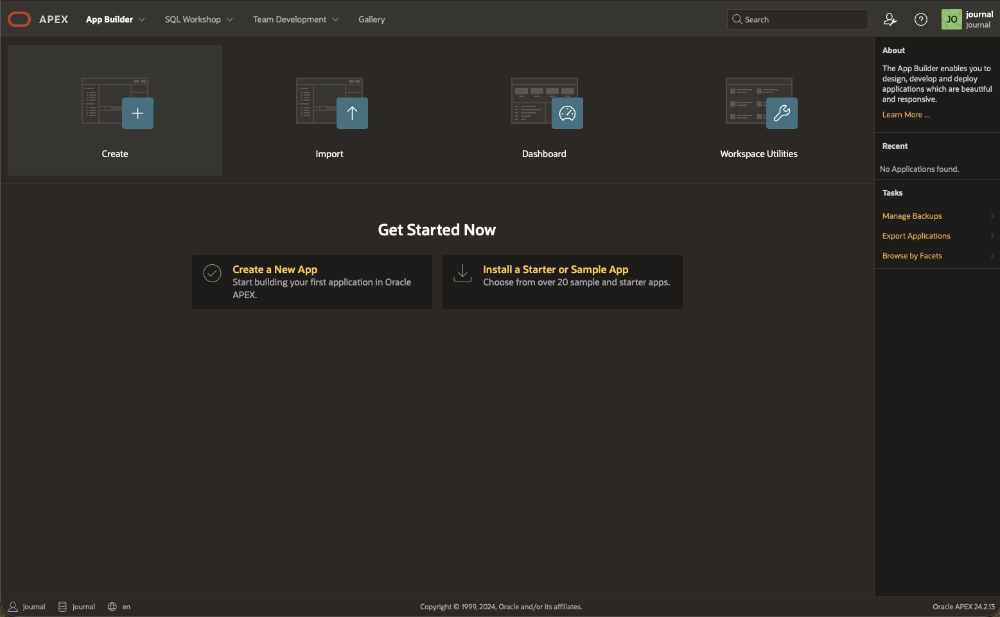

2. Click **Use Create App Wizard**.

3. Set the following properties:

    | Setting | Value |
    |---|---|
    | **Name** | `Dankbaarheid` |
    | **Appearance → Theme Style** | Vita – Dark (we'll customize later) |
    | **Application Icon** | Choose the write page icon or upload a custom icon |

    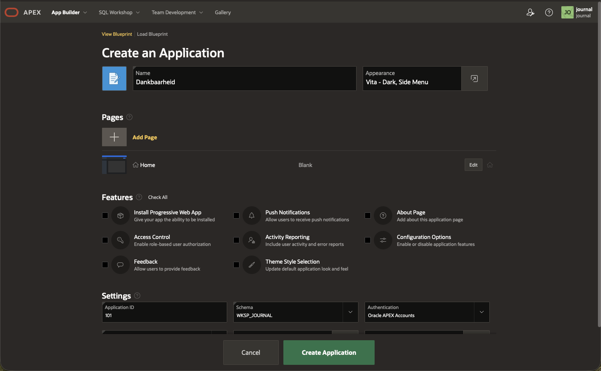

4. We don't need extra standard pages. We will create our own pages.

5. Click **Create Application**.

6. After the application is created, note the **Application ID** (e.g., 100). You'll need this later for push notifications.

    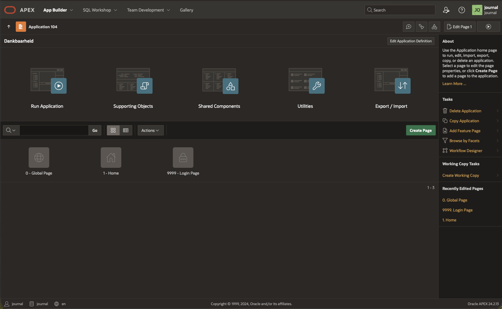

## Task 2: Configure Custom Authentication

1. Navigate to **Shared Components** → **Authentication Schemes**.

    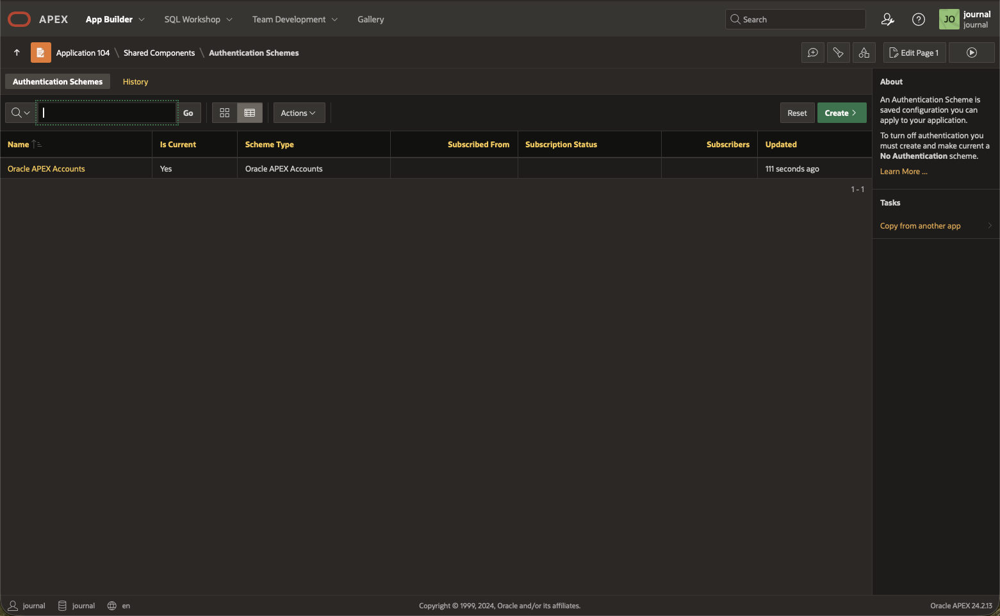

2. Click **Create**.

3. Choose **Based on a pre-configured scheme from the gallery** and click **Next**.

4. Set:
    - **Name**: `Custom Journal Auth`
    - **Scheme Type**: Custom

5. Under **Settings**, set **Authentication Function Name** to:

    ```
    pkg_journal.authenticate_user
    ```

    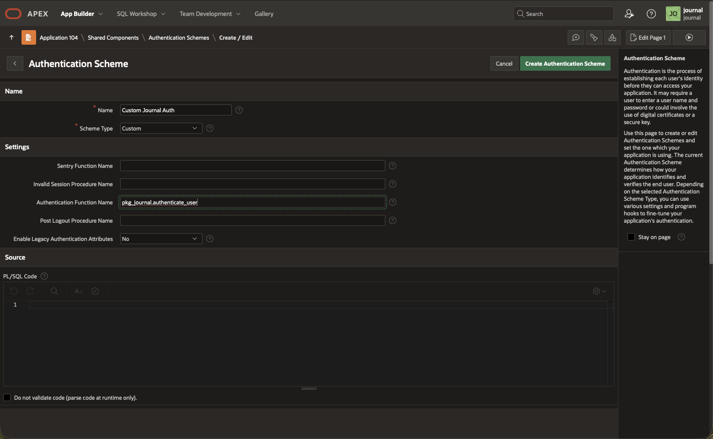

6. Click **Create Authentication Scheme**.

7. The new scheme nees to be set as current. Click on the new scheme and click **Make Current Scheme**

    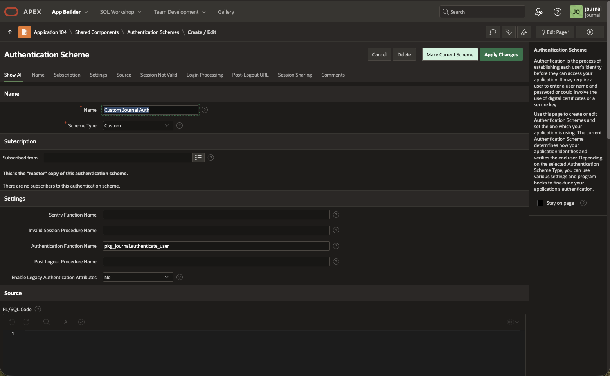

## Task 3: Create the Login Page

APEX created a default login page (typically Page 9999). Let's customize it for Dutch users.

1. In the App Builder, open **Page 9999** (Login Page).

    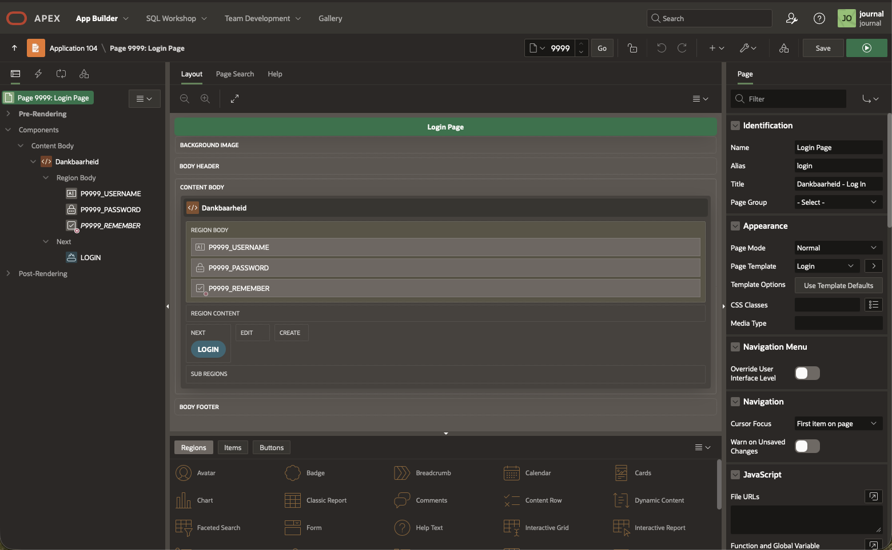

2. In the **Page** properties (left panel), set:
    - **Page Title**: `Inloggen`

3. Find the **Username** item and set:
    - **Label**: `Gebruikersnaam`
    - **Placeholder**: `Voer je gebruikersnaam in`

4. Find the **Password** item and set:
    - **Label**: `Wachtwoord`
    - **Placeholder**: `Voer je wachtwoord in`

5. Find the **Login** button and set:
    - **Label**: `Inloggen`

6. Add a region below the login form for the registration link:
    - Right-click on **Content Body** → **Create Region**
    - **Title**: (leave blank)
    - **Type**: Static Content
    - **Source → HTML Code**:

    ```html
    <div style="text-align: center; margin-top: 16px;">
        <a href="f?p=&APP_ID.:2:&SESSION.">Nog geen account? Registreer hier</a>
    </div>
    ```

    > **Note:** Page 2 will be our registration page, which we create in the next task.

7. Click **Save**.

    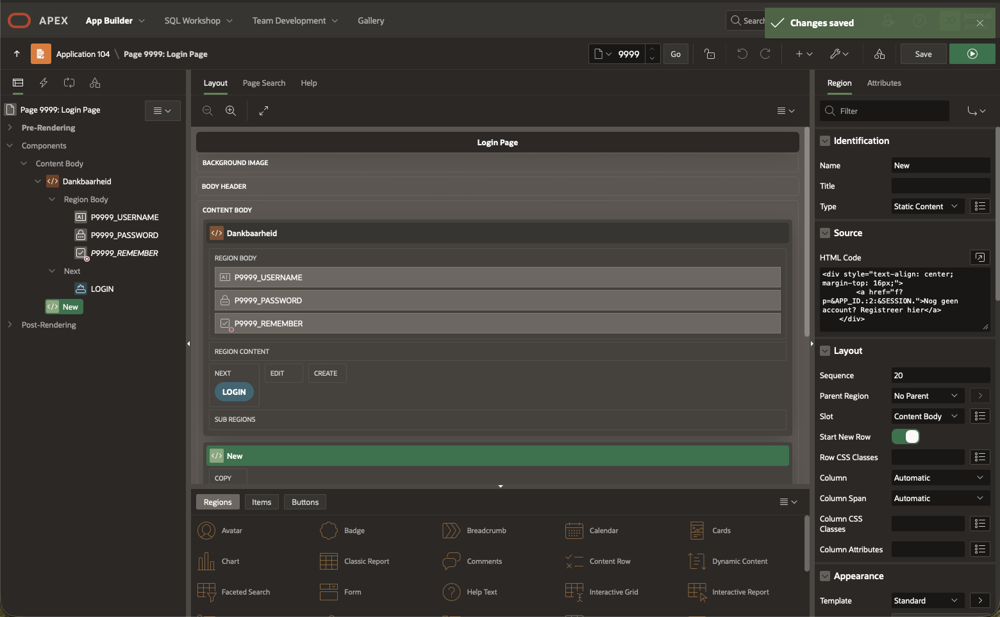

## Task 4: Create the Registration Page

1. In the App Builder, click **Create Page**.

2. Choose **Blank Page** and set:
    - **Page Number**: `2`
    - **Name**: `Registreren`
    - **Page Mode**: Normal
    - **Navigation**: Do NOT include in navigation menu

3. Click **Create Page**.

4. Set the page's **Authentication** property to **Page Is Public** (since users need to register before logging in).

    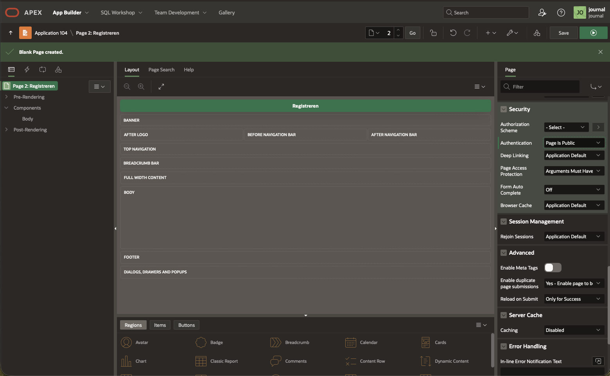

5. Create a **Static Content** region:
    - **Title**: `Account aanmaken`
    - **Template**: Standard
    - **Appearance → Template Options**: Set a reasonable max width (e.g., 480px)

6. Create the following page items inside this region:

    | Item Name | Type | Label | Validation |
    |---|---|---|---|
    | `P2_USERNAME` | Text Field | `Gebruikersnaam` | Required, max 255 chars |
    | `P2_EMAIL` | Text Field | `E-mailadres` | Required, subtype email |
    | `P2_PASSWORD` | Password | `Wachtwoord` | Required |
    | `P2_PASSWORD_CONFIRM` | Password | `Wachtwoord bevestigen` | Required |
    | `P2_DISPLAY_NAME` | Text Field | `Weergavenaam` | Optional |

    For each item, set:
    - **Appearance → Template**: Required (for required fields) or Optional
    - **Placeholder**: Appropriate Dutch text

    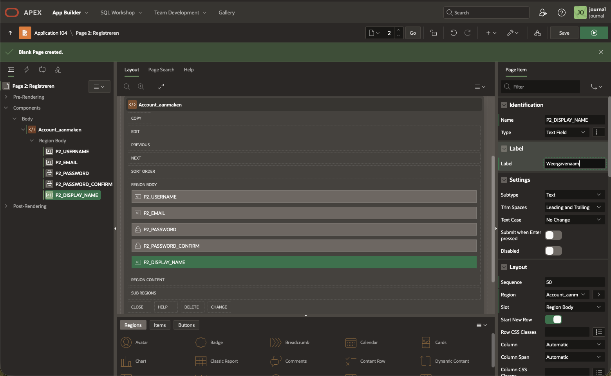

7. Create a **Registreer** button:
    - **Button Name**: `BTN_REGISTER`
    - **Label**: `Registreer`
    - **Action**: Submit Page
    - **Appearance**: Hot

8. Create **Validations**:

    - **Passwords Match**:
        - Type: Function Body (PL/SQL) Returning Boolean
        - PL/SQL:
        ```sql
        RETURN :P2_PASSWORD = :P2_PASSWORD_CONFIRM;
        ```
        - Error Message: `Wachtwoorden komen niet overeen.`
        - When Button Pressed: `BTN_REGISTER`

    - **Password Length**:
        - Type: Function Body (PL/SQL) Returning Boolean
        - PL/SQL:
        ```sql
        RETURN LENGTH(:P2_PASSWORD) >= 8;
        ```
        - Error Message: `Wachtwoord moet minimaal 8 tekens zijn.`

    - **Username Available**:
        - Type: Function Body (PL/SQL) Returning Boolean
        - PL/SQL:
        ```sql
        DECLARE
            v_count NUMBER;
        BEGIN
            SELECT COUNT(*) INTO v_count
            FROM app_users WHERE UPPER(username) = UPPER(:P2_USERNAME);
            RETURN v_count = 0;
        END;
        ```
        - Error Message: `Deze gebruikersnaam is al bezet.`

9. Create a **Process** to register the user:
    - **Name**: `Register User`
    - **Type**: Execute Code (PL/SQL)
    - **When Button Pressed**: `BTN_REGISTER`
    - **PL/SQL Code**:

    ```sql
    DECLARE
        v_user_id NUMBER;
    BEGIN
        pkg_journal.register_user(
            p_username     => :P2_USERNAME,
            p_email        => :P2_EMAIL,
            p_password     => :P2_PASSWORD,
            p_display_name => :P2_DISPLAY_NAME,
            p_user_id      => v_user_id
        );

        -- Auto-login the newly registered user
        apex_authentication.login(
            p_username => :P2_USERNAME,
            p_password => :P2_PASSWORD
        );
    END;
    ```

    - **Success Message**: `Welkom! Je account is aangemaakt.`

10. Create a **Branch** after the process:
    - **Target Page**: `10` (the daily question page, which we create next)

11. Add a link back to login below the form:

    Create a Static Content region with Source HTML:
    ```html
    <div style="text-align: center; margin-top: 16px;">
        <a href="f?p=&APP_ID.:9999:&SESSION.">Al een account? Log hier in</a>
    </div>
    ```

12. Click **Save**.

## Task 5: Create the Daily Question Page

This is the heart of the application — the page users see every day.

1. Create a new **Blank Page**:
    - **Page Number**: `10`
    - **Name**: `Vandaag`
    - **Navigation**: Include in navigation menu (set as first entry)

2. Create a **Before Header** computation to store the current user ID:
    - Right-click on **Pre-Rendering** → **Create Computation**
    - **Item Name**: `P10_USER_ID` (create as Hidden item first)
    - **Type**: Function Body (PL/SQL)
    - **PL/SQL**:
    ```sql
    RETURN pkg_journal.get_current_user_id;
    ```

3. Create the following **Hidden Items** on the page:
    - `P10_USER_ID` — Current user's ID
    - `P10_QUESTION_ID` — Today's question ID
    - `P10_QUESTION_TEXT` — Today's question text
    - `P10_CATEGORY` — Question category
    - `P10_ALREADY_ANSWERED` — Y/N flag
    - `P10_ENTRY_TEXT` - to hold today's answer if already submitted
    - 

4. Create a **Before Header** process to fetch the daily question:
    - **Name**: `Get Daily Question`
    - **Type**: Execute Code (PL/SQL)
    - **PL/SQL Code**:

    ```sql
    BEGIN
        IF pkg_journal.answered_today(:P10_USER_ID) THEN
            :P10_ALREADY_ANSWERED := 'Y';

            -- Fetch today's answer for display
            SELECT je.entry_text, q.text_nl, q.category
            INTO   :P10_ENTRY_TEXT, :P10_QUESTION_TEXT, :P10_CATEGORY
            FROM   journal_entries je
            JOIN   questions q ON je.question_id = q.question_id
            WHERE  je.user_id = :P10_USER_ID
               AND je.entry_date = TRUNC(SYSDATE);
        ELSE
            :P10_ALREADY_ANSWERED := 'N';

            pkg_journal.get_daily_question(
                p_user_id       => :P10_USER_ID,
                p_question_id   => :P10_QUESTION_ID,
                p_question_text => :P10_QUESTION_TEXT,
                p_category      => :P10_CATEGORY
            );
        END IF;
    END;
    ```

5. Create the **Date Header** region:
    - **Type**: Static Content
    - **Template**: Blank with attribute (no grid)
    - **Source → HTML Code**:
    ```html
    <div class="date-header" style="text-align:center; padding: 16px 0 8px;">
        <span style="font-size: 1.1rem; color: #8B7355;">
            &P10_DATE_DISPLAY.
        </span>
    </div>
    ```
    - Create `P10_DATE_DISPLAY` as a hidden item with **Pre-Rendering Computation**:
    ```sql
    RETURN TO_CHAR(SYSDATE, 'Day DD Month YYYY', 'NLS_DATE_LANGUAGE=DUTCH')
    ```

6. Create the **Question Card** region:
    - **Type**: Static Content
    - **Title**: Vraag van de dag
    - **Condition** Item = value: `P10_ALREADY_ANSWERED` = `N`
    - **Source → HTML Code**:
    ```html
    <div class="question-card">
        <span class="category-badge">&P10_CATEGORY.</span>
        <h2 class="question-text">&P10_QUESTION_TEXT.</h2>
    </div>
    ```

    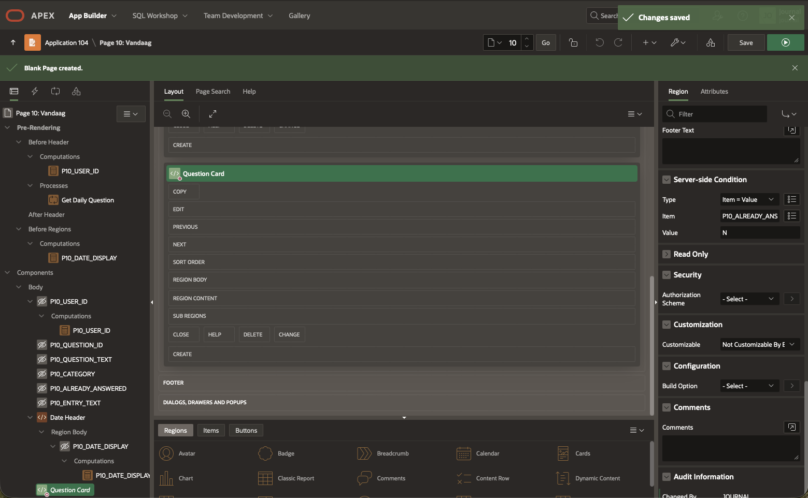

7. Create the **Answer Input** region (only shown when not yet answered):
    - **Type**: Static Content
    - **Title**: (leave blank)
    - **Template**: Blank with attribute (no grid)
    - **Condition** Item = value: `P10_ALREADY_ANSWERED` = `N`
    - Create item `P10_ANSWER_TEXT`:
        - **Type**: Textarea
        - **Label**: `Jouw antwoord`
        - **Placeholder**: `Typ hier je antwoord... (minimaal 10 tekens)`
        - **Height**: 5 rows

8. Create the **Submit Button**:
    - **Button Name**: `BTN_SUBMIT`
    - **Label**: `Opslaan`
    - **Action**: Defined by Dynamic Action (we'll use this to do an AJAX call)
    - **Condition**: `P10_ALREADY_ANSWERED` = `N`
    - **Appearance**: Hot

9. Create a **Dynamic Action** on the Submit button click:
    - **Event**: Click
    - **Selection Type**: Button → `BTN_SUBMIT`
    - **Client-side Condition** (JavaScript):
    ```javascript
    $v('P10_ANSWER_TEXT').trim().length >= 10
    ```

    **True Actions:**

    a. **Execute Server-side Code** (PL/SQL):
    ```sql
    DECLARE
        v_is_dup  NUMBER;
        v_dup_txt VARCHAR2(4000);
        v_dup_dt  DATE;
        v_dup_pct NUMBER;
        v_entry   NUMBER;
    BEGIN
        pkg_journal.submit_entry(
            p_user_id       => :P10_USER_ID,
            p_question_id   => :P10_QUESTION_ID,
            p_entry_text    => :P10_ANSWER_TEXT,
            p_is_duplicate  => v_is_dup,
            p_dup_text      => v_dup_txt,
            p_dup_date      => v_dup_dt,
            p_dup_pct       => v_dup_pct,
            p_entry_id      => v_entry
        );

        IF v_is_dup = 1 THEN
            :P10_DUP_ERROR := 'Je gaf dit antwoord al op '
                || TO_CHAR(v_dup_dt, 'DD Month YYYY', 'NLS_DATE_LANGUAGE=DUTCH')
                || ' (' || v_dup_pct || '% gelijk)';
            :P10_DUP_PREV_TEXT := v_dup_txt;
        ELSE
            :P10_DUP_ERROR := NULL;
            :P10_DUP_PREV_TEXT := NULL;
        END IF;
    END;
    ```
    - **Items to Submit**: `P10_ANSWER_TEXT,P10_USER_ID,P10_QUESTION_ID`
    - **Items to Return**: `P10_DUP_ERROR,P10_DUP_PREV_TEXT`

    b. **Execute JavaScript Code** (runs after the server call):
    ```javascript
    var dupError = $v('P10_DUP_ERROR');
    if (dupError && dupError.length > 0) {
        // Show duplicate error
        $('#dup-error-banner').remove();
        var html = '<div id="dup-error-banner" class="dup-error-banner">' +
            '<div class="dup-error-icon">✕</div>' +
            '<div class="dup-error-msg">' + apex.util.escapeHTML(dupError) + '</div>' +
            '<details class="dup-error-details">' +
            '<summary>Vorig antwoord bekijken ▾</summary>' +
            '<p class="dup-prev-text">' + apex.util.escapeHTML($v('P10_DUP_PREV_TEXT')) + '</p>' +
            '</details>' +
            '<div class="dup-error-tip">💡 Bedenk iets specifieks of anders waar je dankbaar voor bent</div>' +
            '</div>';
        $('#P10_ANSWER_TEXT').closest('.t-Form-fieldContainer').before(html);
        // Keep focus on textarea
        $('#P10_ANSWER_TEXT').focus();
    } else {
        // Success! Reload the page to show the "already answered" state
        apex.page.submit({request: 'AFTER_SUBMIT', showWait: true});
    }
    ```

    > **Note:** Create `P10_DUP_ERROR` and `P10_DUP_PREV_TEXT` as additional Hidden items.

10. Create the **Already Answered** region (shown when user has answered today):
    - **Type**: Static Content
    - **Title**: (leave blank)
    - **Condition**: `P10_ALREADY_ANSWERED` = `Y`
    - **Source → HTML Code**:
    ```html
    <div class="success-card">
        <div class="success-icon">✅</div>
        <h2>Je hebt vandaag al je dankbaarheid gedeeld!</h2>
        <div class="today-question">&P10_QUESTION_TEXT.</div>
        <div class="today-answer">&P10_ENTRY_TEXT.</div>
        <a href="f?p=&APP_ID.:20:&SESSION." class="t-Button t-Button--warm">
            <span class="fa fa-history"></span> Bekijk eerdere antwoorden
        </a>
    </div>
    ```

    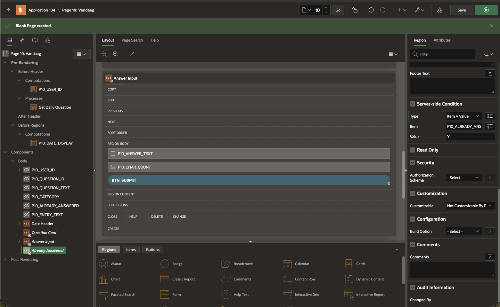

12. Click **Save** and **Run** to test.

    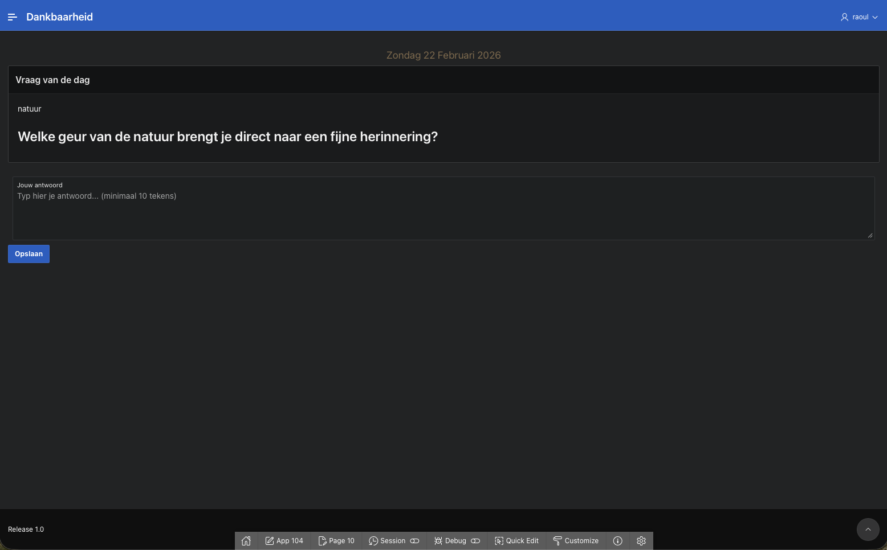

## Task 6: Create the History Page

1. Create a new **Blank Page**:
    - **Page Number**: `20`
    - **Name**: `Mijn antwoorden`
    - **Navigation**: Include in navigation menu

2. Create a **Cards** region:
    - **Title**: `Jouw dankbaarheids-reis`
    - **Type**: Cards
    - **Source → SQL Query**:

    ```sql
    SELECT
        je.entry_id,
        je.entry_text,
        je.entry_date,
        TO_CHAR(je.entry_date, 'DD Month YYYY', 'NLS_DATE_LANGUAGE=DUTCH') AS date_display,
        q.text_nl AS question_text,
        q.category,
        INITCAP(q.category) AS category_display
    FROM   journal_entries je
    JOIN   questions q ON je.question_id = q.question_id
    WHERE  je.user_id = pkg_journal.get_current_user_id
    ORDER BY je.entry_date DESC
    ```

3. Configure the **Cards** attributes:
    - **Card → Primary Key Column**: `ENTRY_ID`
    - **Title Column**: `DATE_DISPLAY`
    - **Subtitle Column**: `QUESTION_TEXT`
    - **Body Column**: `ENTRY_TEXT`
    - **Badge Column**: `CATEGORY_DISPLAY`
    - **Badge CSS Classes**: `u-color-` (different colors per category)

    

4. Set **Pagination**:
    - **Type**: Scroll (loads more as user scrolls)

5. Add a stats header above the cards. Create a **Static Content** region positioned before the cards:
    - **Title**: `Jouw dankbaarheids-reis`
    - **Source → SQL Query** (use PL/SQL Dynamic Content type):

    ```sql
    DECLARE
        v_total  NUMBER;
        v_streak NUMBER;
        v_uid    NUMBER := pkg_journal.get_current_user_id;
    BEGIN
        SELECT COUNT(*) INTO v_total
        FROM   journal_entries
        WHERE  user_id = v_uid;

        v_streak := pkg_journal.get_current_streak(v_uid);

        HTP.P('<div class="stats-bar">');
        HTP.P('<span class="stat"><strong>' || v_total || '</strong> antwoorden</span>');
        HTP.P('<span class="stat">🔥 <strong>' || v_streak || '</strong> dagen streak</span>');
        HTP.P('</div>');
    END;
    ```

6. Click **Save**.

    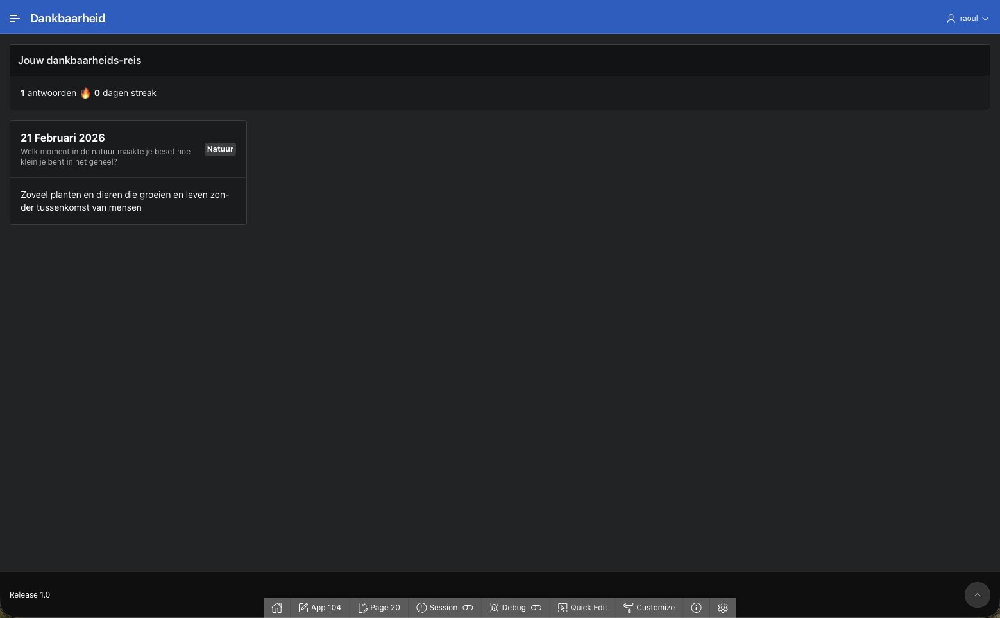

## Task 7: Create the Settings Page

1. Create a new **Blank Page**:
    - **Page Number**: `30`
    - **Name**: `Instellingen`
    - **Navigation**: Include in navigation menu

2. Create a **Static Content** region for **Profiel**:
    - **Title**: `Profiel`
    - Create items:
        - `P30_EMAIL` — Display Only, source from query:
        ```sql
        SELECT email FROM app_users WHERE user_id = pkg_journal.get_current_user_id
        ```
        - `P30_DARK_MODE` — Switch (On/Off)
            - **Label**: `Donker thema`

3. Create a **Save** button and process:
    - Process PL/SQL:
    ```sql
    UPDATE app_users
    SET    display_name = :P30_DISPLAY_NAME,
           dark_mode    = :P30_DARK_MODE
    WHERE  user_id = pkg_journal.get_current_user_id;
    ```

4. Create a **Static Content** region for **Data Export**:
    - **Title**: `Data & Privacy`
    - Add button `BTN_EXPORT`:
        - **Label**: `Download mijn data`
        - **Action**: Redirect to URL
        - **URL**: (we'll create this as a separate download page/process)

5. Create a **Static Content** region for **App Info**:
    - **Source → HTML Code**:
    ```html
    <div class="app-info">
        <p><strong>Versie:</strong> 1.0.0</p>
        <p><strong>Database:</strong> Oracle AI Database 26ai</p>
        <p><strong>Platform:</strong> Oracle APEX 24.2</p>
    </div>
    ```

6. Click **Save**.

    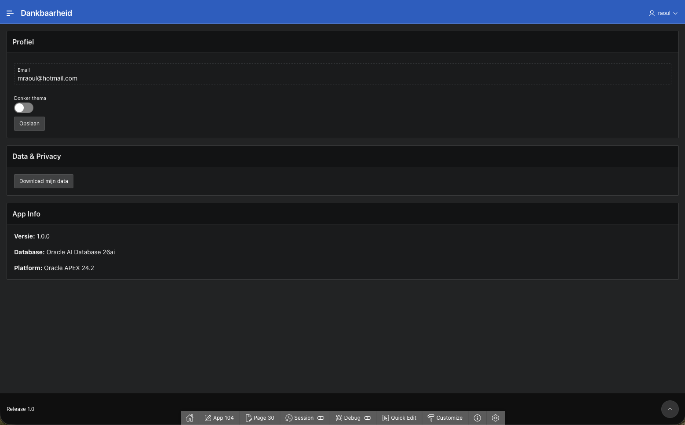

## Task 8: Add Streak Badge to Navigation Bar

1. Navigate to **Shared Components** → **Navigation Bar List**.

2. Click on the default navigation bar list.

3. Click **Create Entry** and set:
    - **Sequence**: 5 (to appear first)
    - **Image/Class**: `fa-fire`
    - **Target**: `No Target`
    - **List Entry Label**:
    ```
    🔥 &P0_STREAK. dagen
    ```

4. Navigate to **Shared Components** → **Application Items**:
    - Create `P0_STREAK` as an application-level item.

5. Navigate to **Shared Components** → **Application Processes**:
    - Create a new process:
        - **Name**: `Set Streak`
        - **Point**: On Load: Before Header 
        - **PL/SQL Code**:
        ```sql
        BEGIN
            :P0_STREAK := pkg_journal.get_current_streak(
                pkg_journal.get_current_user_id
            );
        EXCEPTION
            WHEN OTHERS THEN
                :P0_STREAK := 0;
        END;
        ```

    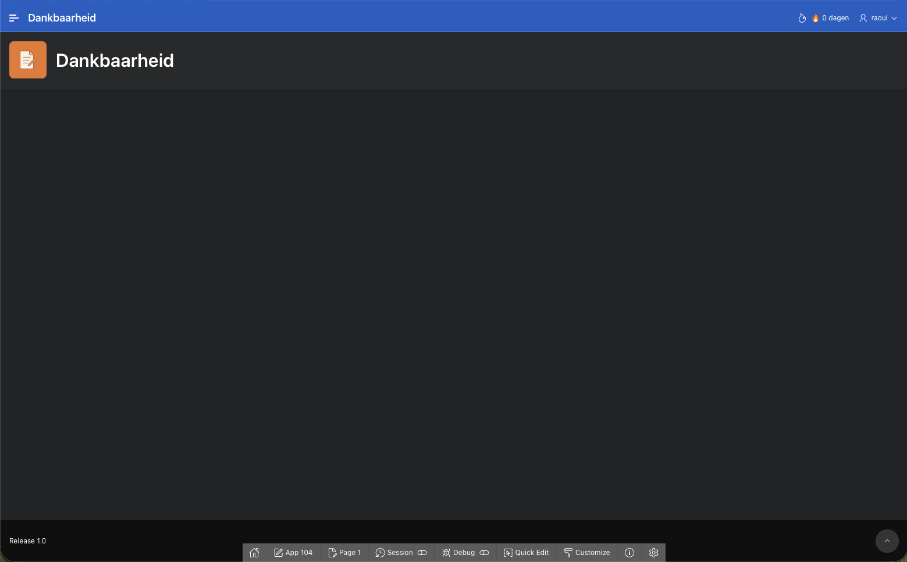

6. Click **Save**.

## Task 9: Test the Complete Application

1. Click **Run Application** from the App Builder.

    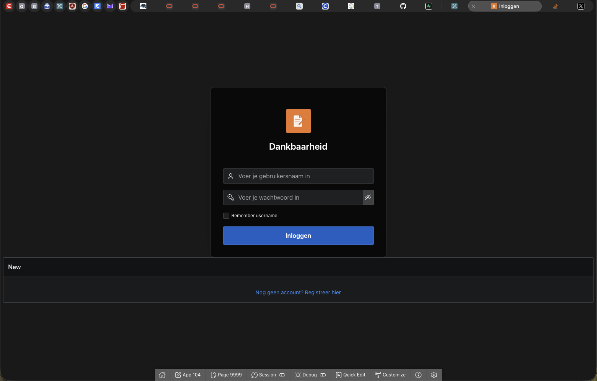

2. Test the following flow:

    - [ ] Go to the Registration page and create a new account
    - [ ] After registration, you should be auto-logged in and see the Daily Question
    - [ ] Type an answer (less than 10 characters)
    - [ ] Type an answer (10+ characters) and click **Opslaan**
    - [ ] Verify the success state shows ("Je hebt vandaag al je dankbaarheid gedeeld!")
    - [ ] Navigate to **Mijn antwoorden** — verify your entry appears
    - [ ] Navigate to **Instellingen** — verify your email shows
    - [ ] Log out and log back in — verify your session works
    - [ ] Check the navigation bar shows the streak badge

    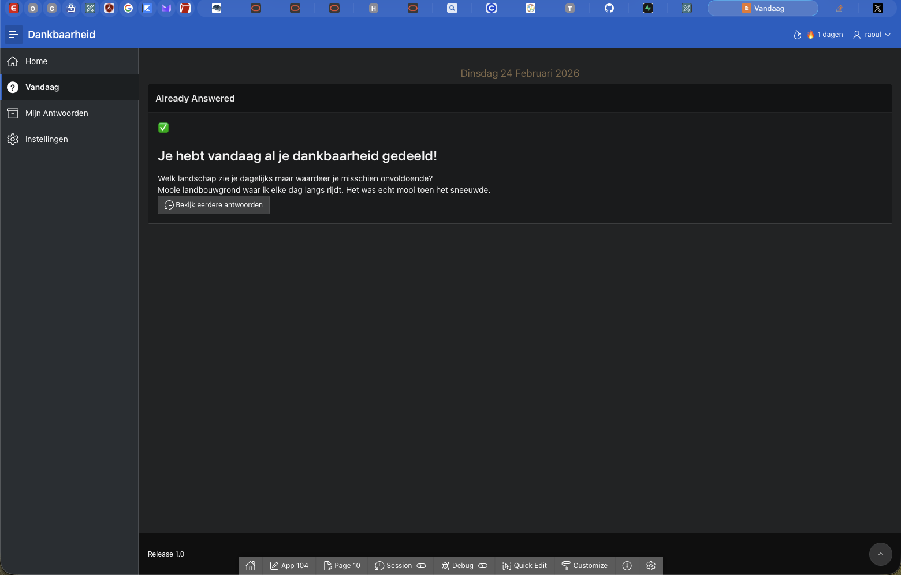

> **Note:** The duplicate detection test requires two entries. Since we enforce one-per-day, you'll need to wait a day or temporarily modify the `je_one_per_day_uq` constraint to test duplicates. We'll also do a thorough duplicate detection test in Lab 4.

Your APEX application is now functional! You may now **proceed to the next lab** to fine-tune the duplicate detection feature.

## Acknowledgements

* **Author** - Raoul, Oracle APEX Developer
* **Last Updated By/Date** - Raoul, February 2026
