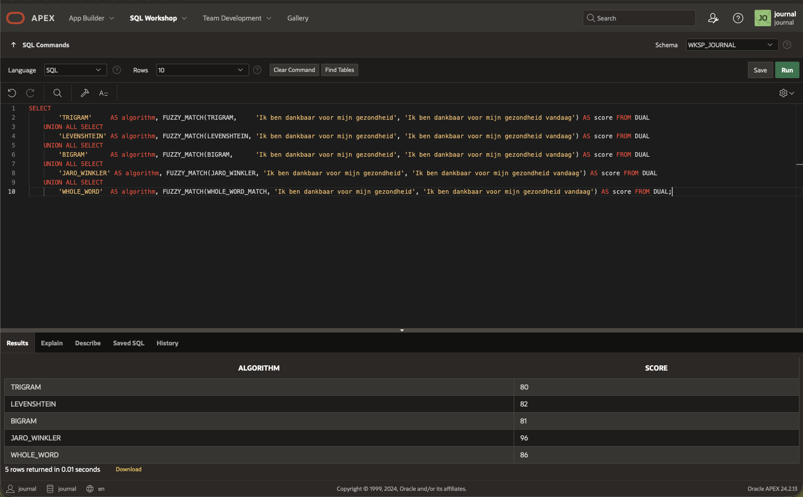
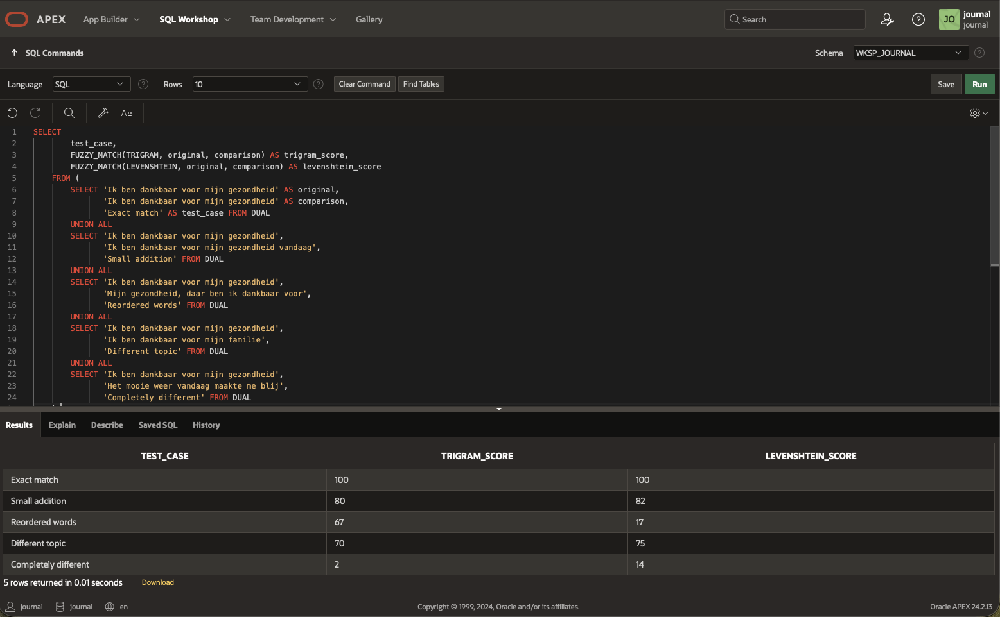
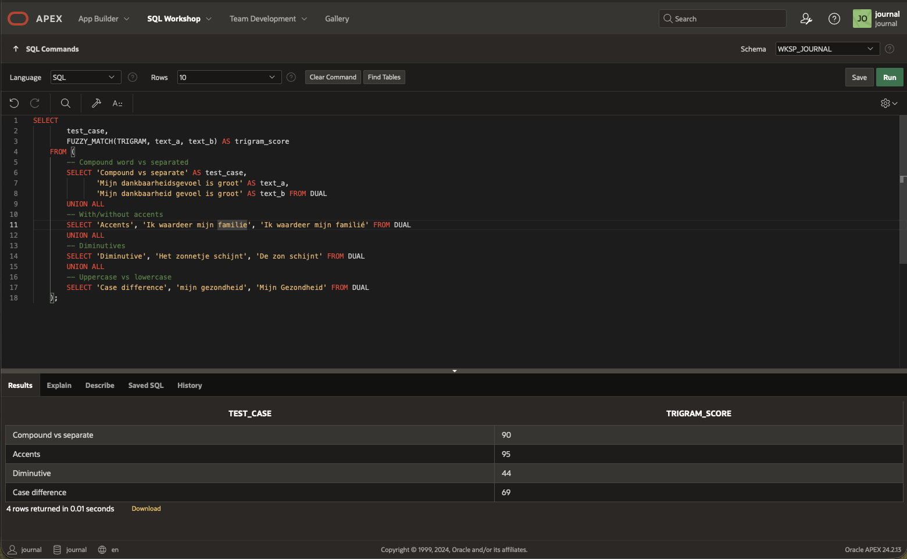
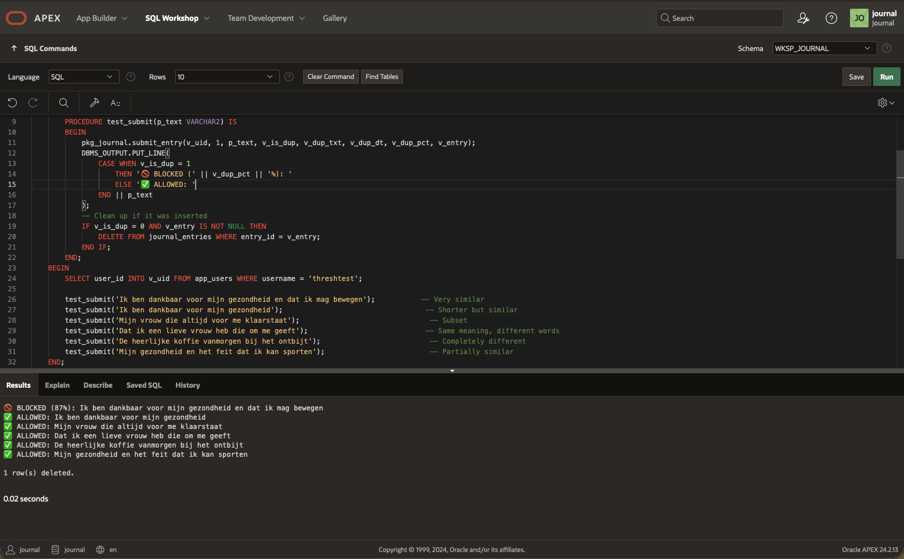
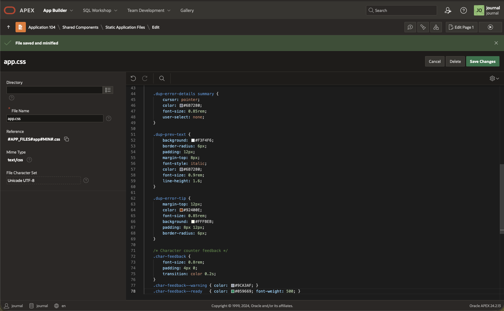
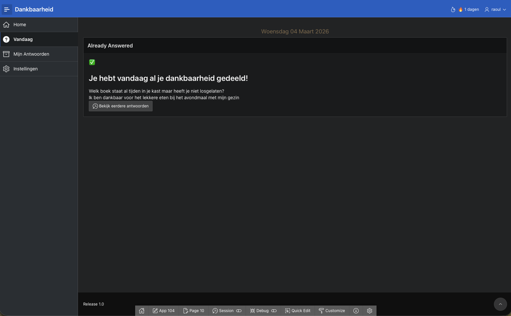
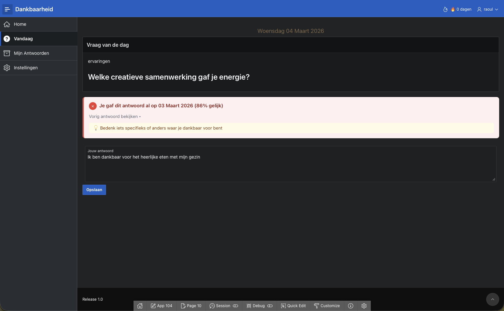
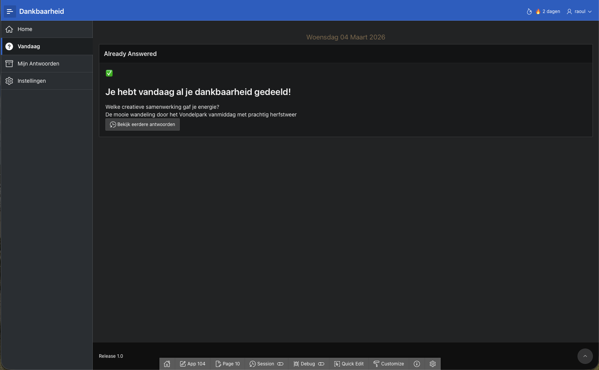

# Lab 4: Implement Fuzzy Duplicate Detection

## Introduction

The hard duplicate blocking feature is what makes this app unique among gratitude journals. In this lab, you will explore how `FUZZY_MATCH` works, test it with Dutch text, fine-tune the similarity threshold, and add proper error UI so users get a clear, helpful message when a duplicate is detected — including the ability to see their previous answer.

Estimated Time: 25 minutes

### Objectives

In this lab, you will:
- Understand how `FUZZY_MATCH(TRIGRAM, ...)` compares text
- Test similarity thresholds with Dutch gratitude entries
- Add CSS for the duplicate error banner
- Verify end-to-end duplicate detection in the app
- Learn the `UTL_MATCH` fallback for older database versions

### Prerequisites

This lab assumes you have:
- Completed Lab 3 (working APEX application)
- Access to SQL Workshop → SQL Commands

## Task 1: Understand FUZZY_MATCH Algorithms

Oracle's `FUZZY_MATCH` operator (available since 23ai/26ai) supports seven algorithms. Let's test the ones most relevant for Dutch journal entries.

1. Navigate to **SQL Workshop** → **SQL Commands**.

2. Run this query to compare two similar Dutch entries using different algorithms:

    ```sql
    SELECT
        'TRIGRAM'     AS algorithm, FUZZY_MATCH(TRIGRAM,     'Ik ben dankbaar voor mijn gezondheid', 'Ik ben dankbaar voor mijn gezondheid vandaag') AS score FROM DUAL
    UNION ALL SELECT
        'LEVENSHTEIN' AS algorithm, FUZZY_MATCH(LEVENSHTEIN, 'Ik ben dankbaar voor mijn gezondheid', 'Ik ben dankbaar voor mijn gezondheid vandaag') AS score FROM DUAL
    UNION ALL SELECT
        'BIGRAM'      AS algorithm, FUZZY_MATCH(BIGRAM,      'Ik ben dankbaar voor mijn gezondheid', 'Ik ben dankbaar voor mijn gezondheid vandaag') AS score FROM DUAL
    UNION ALL SELECT
        'JARO_WINKLER' AS algorithm, FUZZY_MATCH(JARO_WINKLER, 'Ik ben dankbaar voor mijn gezondheid', 'Ik ben dankbaar voor mijn gezondheid vandaag') AS score FROM DUAL
    UNION ALL SELECT
        'WHOLE_WORD'  AS algorithm, FUZZY_MATCH(WHOLE_WORD_MATCH, 'Ik ben dankbaar voor mijn gezondheid', 'Ik ben dankbaar voor mijn gezondheid vandaag') AS score FROM DUAL;
    ```

    

    You'll notice:
    - **TRIGRAM** gives good scores for similar texts with added/removed words
    - **LEVENSHTEIN** is stricter for longer texts (penalizes every character difference)
    - **JARO_WINKLER** inflates scores for longer strings — designed for short names, **not recommended** for sentences
    - **WHOLE_WORD_MATCH** compares at word level, good for reordered sentences

3. Test with progressively more different entries:

    ```sql
    SELECT
        test_case,
        FUZZY_MATCH(TRIGRAM, original, comparison) AS trigram_score,
        FUZZY_MATCH(LEVENSHTEIN, original, comparison) AS levenshtein_score
    FROM (
        SELECT 'Ik ben dankbaar voor mijn gezondheid' AS original,
               'Ik ben dankbaar voor mijn gezondheid' AS comparison,
               'Exact match' AS test_case FROM DUAL
        UNION ALL
        SELECT 'Ik ben dankbaar voor mijn gezondheid',
               'Ik ben dankbaar voor mijn gezondheid vandaag',
               'Small addition' FROM DUAL
        UNION ALL
        SELECT 'Ik ben dankbaar voor mijn gezondheid',
               'Mijn gezondheid, daar ben ik dankbaar voor',
               'Reordered words' FROM DUAL
        UNION ALL
        SELECT 'Ik ben dankbaar voor mijn gezondheid',
               'Ik ben dankbaar voor mijn familie',
               'Different topic' FROM DUAL
        UNION ALL
        SELECT 'Ik ben dankbaar voor mijn gezondheid',
               'Het mooie weer vandaag maakte me blij',
               'Completely different' FROM DUAL
    );
    ```

    

    **Key insight:** We use `GREATEST(TRIGRAM, LEVENSHTEIN)` in our procedure because TRIGRAM handles word reordering better, while LEVENSHTEIN catches very close edits. Taking the maximum of both gives the best detection coverage.

## Task 2: Test with Dutch-Specific Cases

Dutch has unique characteristics: compound words, accented characters (ë, ï, é), and articles (de/het). Let's test these.

1. Test compound words and accented characters:

    ```sql
    SELECT
        test_case,
        FUZZY_MATCH(TRIGRAM, text_a, text_b) AS trigram_score
    FROM (
        -- Compound word vs separated
        SELECT 'Compound vs separate' AS test_case,
               'Mijn dankbaarheidsgevoel is groot' AS text_a,
               'Mijn dankbaarheid gevoel is groot' AS text_b FROM DUAL
        UNION ALL
        -- With/without accents
        SELECT 'Accents', 'Ik waardeer mijn familie', 'Ik waardeer mijn familié' FROM DUAL
        UNION ALL
        -- Diminutives
        SELECT 'Diminutive', 'Het zonnetje schijnt', 'De zon schijnt' FROM DUAL
        UNION ALL
        -- Uppercase vs lowercase
        SELECT 'Case difference', 'mijn gezondheid', 'Mijn Gezondheid' FROM DUAL
    );
    ```

    

    > **Note:** Our `submit_entry` procedure normalizes text to lowercase before comparison, so case differences are already handled. The `FUZZY_MATCH` operator handles multi-byte characters (like ë, ï) correctly in 26ai because it operates on characters, not bytes (unlike the older `UTL_MATCH`).

## Task 3: Verify the 85% Threshold

The 85% threshold was chosen to catch lazy repetitions while allowing genuinely different entries. Let's verify this works well.

1. First, create test data. Temporarily allow multiple entries per day for testing:

    ```sql
    -- Temporarily disable the one-per-day constraint
    ALTER TABLE journal_entries DROP CONSTRAINT je_one_per_day_uq;

    -- Create a test user
    DECLARE
        v_uid NUMBER;
    BEGIN
        pkg_journal.register_user('threshtest', 'thresh@test.com', 'Test1234!', 'Threshold Tester', v_uid);

        -- Insert several entries
        INSERT INTO journal_entries (user_id, question_id, entry_text, entry_date)
        VALUES (v_uid, 1, 'Ik ben dankbaar voor mijn gezondheid en dat ik elke dag mag bewegen', TRUNC(SYSDATE) - 10);

        INSERT INTO journal_entries (user_id, question_id, entry_text, entry_date)
        VALUES (v_uid, 2, 'Mijn vrouw die altijd voor me klaarstaat en me steunt', TRUNC(SYSDATE) - 9);

        INSERT INTO journal_entries (user_id, question_id, entry_text, entry_date)
        VALUES (v_uid, 3, 'Het mooie herfstweer en de kleurrijke bladeren in het park', TRUNC(SYSDATE) - 8);

        COMMIT;
    END;
    /
    ```

2. Now test various submissions against these entries:

    ```sql
    DECLARE
        v_uid     NUMBER;
        v_is_dup  NUMBER;
        v_dup_txt VARCHAR2(4000);
        v_dup_dt  DATE;
        v_dup_pct NUMBER;
        v_entry   NUMBER;

        PROCEDURE test_submit(p_text VARCHAR2) IS
        BEGIN
            pkg_journal.submit_entry(v_uid, 1, p_text, v_is_dup, v_dup_txt, v_dup_dt, v_dup_pct, v_entry);
            DBMS_OUTPUT.PUT_LINE(
                CASE WHEN v_is_dup = 1
                    THEN '🚫 BLOCKED (' || v_dup_pct || '%): '
                    ELSE '✅ ALLOWED: '
                END || p_text
            );
            -- Clean up if it was inserted
            IF v_is_dup = 0 AND v_entry IS NOT NULL THEN
                DELETE FROM journal_entries WHERE entry_id = v_entry;
            END IF;
        END;
    BEGIN
        SELECT user_id INTO v_uid FROM app_users WHERE username = 'threshtest';

        test_submit('Ik ben dankbaar voor mijn gezondheid en dat ik mag bewegen');           -- Very similar
        test_submit('Ik ben dankbaar voor mijn gezondheid');                                  -- Shorter but similar
        test_submit('Mijn vrouw die altijd voor me klaarstaat');                               -- Subset
        test_submit('Dat ik een lieve vrouw heb die om me geeft');                            -- Same meaning, different words
        test_submit('De heerlijke koffie vanmorgen bij het ontbijt');                          -- Completely different
        test_submit('Mijn gezondheid en het feit dat ik kan sporten');                         -- Partially similar
    END;
    /
    ```

    

3. Clean up test data and restore the constraint:

    ```sql
    -- Clean up
    DELETE FROM journal_entries WHERE user_id = (SELECT user_id FROM app_users WHERE username = 'threshtest');
    DELETE FROM question_history WHERE user_id = (SELECT user_id FROM app_users WHERE username = 'threshtest');
    DELETE FROM app_users WHERE username = 'threshtest';
    COMMIT;

    -- Restore the one-per-day constraint
    ALTER TABLE journal_entries ADD CONSTRAINT je_one_per_day_uq UNIQUE (user_id, entry_date);
    ```

## Task 4: Add Duplicate Error CSS

1. Navigate to **Shared Components** → **Static Application Files**.

2. If you haven't created `app.css` yet (we'll add more in Lab 6), create it now. Otherwise, add these styles to the existing file:

    ```css
    /* ============================================
       Duplicate Error Banner
       ============================================ */
    .dup-error-banner {
        background-color: #FEF2F2;
        border-left: 4px solid #EF4444;
        border-radius: 8px;
        padding: 16px;
        margin-bottom: 16px;
        animation: slideDown 0.3s ease-out;
    }

    @keyframes slideDown {
        from { opacity: 0; transform: translateY(-10px); }
        to   { opacity: 1; transform: translateY(0); }
    }

    .dup-error-icon {
        display: inline-block;
        width: 24px;
        height: 24px;
        background: #EF4444;
        color: white;
        border-radius: 50%;
        text-align: center;
        line-height: 24px;
        font-size: 14px;
        font-weight: bold;
        margin-right: 8px;
        vertical-align: middle;
    }

    .dup-error-msg {
        display: inline;
        color: #991B1B;
        font-weight: 600;
        font-size: 0.95rem;
    }

    .dup-error-details {
        margin-top: 12px;
    }

    .dup-error-details summary {
        cursor: pointer;
        color: #6B7280;
        font-size: 0.85rem;
        user-select: none;
    }

    .dup-prev-text {
        background: #F3F4F6;
        border-radius: 6px;
        padding: 12px;
        margin-top: 8px;
        font-style: italic;
        color: #6B7280;
        font-size: 0.9rem;
        line-height: 1.6;
    }

    .dup-error-tip {
        margin-top: 12px;
        color: #92400E;
        font-size: 0.85rem;
        background: #FFFBEB;
        padding: 8px 12px;
        border-radius: 6px;
    }

    /* Character counter feedback */
    .char-feedback {
        font-size: 0.8rem;
        padding: 4px 0;
        transition: color 0.2s;
    }
    .char-feedback--warning { color: #9CA3AF; }
    .char-feedback--ready   { color: #059669; font-weight: 500; }
    ```

    

3. Reference the CSS file. Go to **Shared Components** → **User Interface Attributes** → **CSS → File URLs**:

    ```
    #APP_FILES#app#MIN#.css
    ```

## Task 5: Test Duplicate Detection in the App

Since we enforce one entry per day, to properly test duplicate detection in the running app, we need two days. However, we can simulate this.

1. Run your APEX application and log in.

2. Submit a journal entry with the text: `Ik ben dankbaar voor het lekkere eten bij het avondmaal met mijn gezin`

    

3. To test duplicate detection without waiting a day, temporarily insert a backdated entry via SQL Commands:

    ```sql
    -- Insert a backdated entry (pretend it was submitted yesterday)
    INSERT INTO journal_entries (user_id, question_id, entry_text, entry_date)
    SELECT
        u.user_id,
        1,
        'Ik ben dankbaar voor het heerlijke eten met mijn gezin vanavond',
        TRUNC(SYSDATE) - 1
    FROM app_users u
    WHERE u.username = '<your-username>';

    COMMIT;
    ```

    > **Note:** Replace `<your-username>` with the username you registered with.

4. Delete today's entry so you can submit again:

    ```sql
    DELETE FROM journal_entries
    WHERE user_id = (SELECT user_id FROM app_users WHERE username = '<your-username>')
      AND entry_date = TRUNC(SYSDATE);
    COMMIT;
    ```

5. Go back to the app and try submitting: `Ik ben dankbaar voor het lekkere eten met mijn gezin`

6. You should see the red duplicate error banner with the previous answer date and text.

    

7. Now modify the text to something sufficiently different: `De mooie wandeling door het Vondelpark vanmiddag met prachtig herfstweer`

8. This should be accepted and saved successfully.

    

## Task 6: UTL_MATCH Fallback (Optional)

If your database version is older than 23ai and `FUZZY_MATCH` is not available, you can replace the duplicate detection in `PKG_JOURNAL.SUBMIT_ENTRY` with `UTL_MATCH`:

```sql
-- Replace the FUZZY_MATCH section in submit_entry with:
SELECT entry_text, entry_date,
       UTL_MATCH.EDIT_DISTANCE_SIMILARITY(
           v_normalized_new,
           TRIM(REGEXP_REPLACE(LOWER(entry_text), '\s+', ' '))
       ) AS sim_score
INTO   p_dup_text, p_dup_date, p_dup_pct
FROM (
    SELECT entry_text, entry_date,
           UTL_MATCH.EDIT_DISTANCE_SIMILARITY(
               v_normalized_new,
               TRIM(REGEXP_REPLACE(LOWER(entry_text), '\s+', ' '))
           ) AS sim_score
    FROM journal_entries
    WHERE user_id = p_user_id
      AND entry_date >= TRUNC(SYSDATE) - p_days_back
    ORDER BY sim_score DESC
)
WHERE sim_score >= p_threshold
  AND ROWNUM = 1;
```

> **Note:** `UTL_MATCH.EDIT_DISTANCE_SIMILARITY` works byte-by-byte, not character-by-character. This is adequate for Dutch in AL32UTF8 encoding but less precise for accented characters compared to `FUZZY_MATCH`. Use `FUZZY_MATCH` if your database supports it.

Your duplicate detection is now fully implemented and tested! You may now **proceed to the next lab**.

## Acknowledgements

* **Author** - Raoul, Oracle APEX Developer
* **Last Updated By/Date** - Raoul, February 2026
