# Lab 5: PWA and Push Notifications

## Introduction

In this lab, you will transform the APEX application into a Progressive Web App (PWA) that users can install on their phone's home screen, and configure native push notifications to send a daily reminder at 21:00 Amsterdam time. APEX handles all the complexity — no Firebase, no custom service workers, no third-party services required.

Estimated Time: 30 minutes

### Objectives

In this lab, you will:
- Enable PWA features in APEX (installable, standalone mode)
- Configure native push notifications with VAPID credentials
- Create an opt-in settings page for notifications
- Schedule a daily reminder at 21:00 using `DBMS_SCHEDULER`
- Test push notifications on a mobile device

### Prerequisites

This lab assumes you have:
- Completed Lab 4 (working APEX application with duplicate detection)
- A smartphone (iOS 16.4+ or Android) for testing PWA installation
- Your APEX application running on OCI (HTTPS is required for PWA — automatic on OCI)

> **Important:** PWA and push notification features require **HTTPS**. The OCI Autonomous Database APEX URL uses HTTPS by default, so this is already handled. If you're testing locally (e.g., on apex.oracle.com), HTTPS is also provided.

## Task 1: Enable Progressive Web App

1. Navigate to **Shared Components** → **Progressive Web App**.

    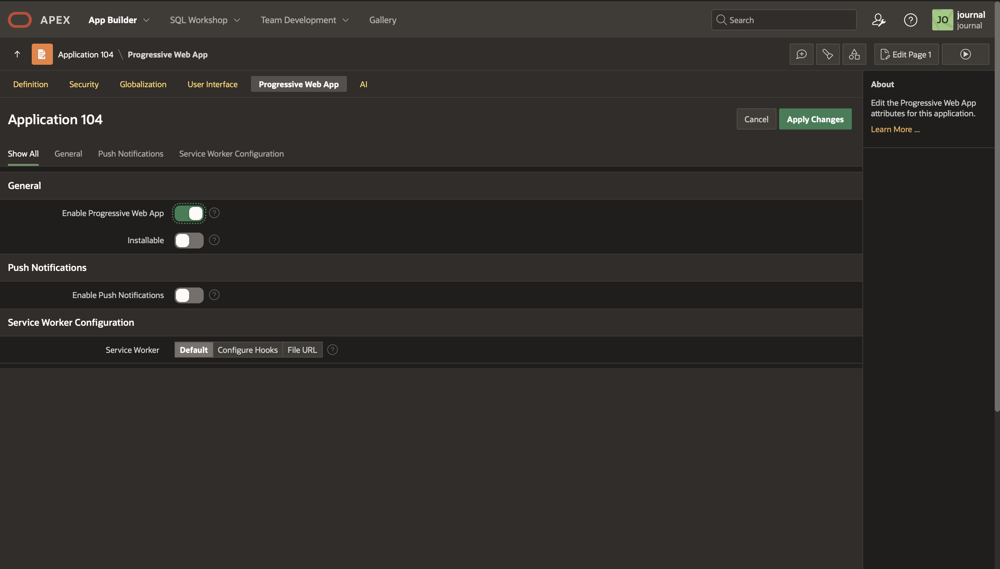

2. Set the following properties:

    | Setting | Value |
    |---|---|
    | **Enable Progressive Web App** | On |
    | **Installable** | Yes |
    | **Display** | Standalone |
    | **Screen Orientation** | Any |
    | **Theme Color** | `#8B7355` |
    | **Background Color** | `#F5F0E8` |

    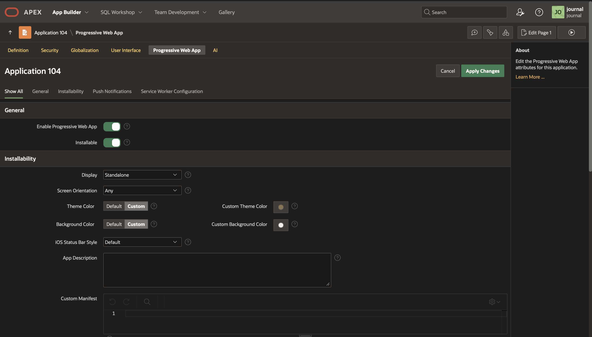

3. Upload an **App Icon**. APEX requires one icon and auto-generates all sizes needed for different devices.

    > **Tip:** Use a simple icon — a heart emoji, a gratitude symbol, or the letter "D" for Dankbaarheid. The icon should be at least 512x512 pixels, PNG format, with a transparent or `#F5F0E8` background.

    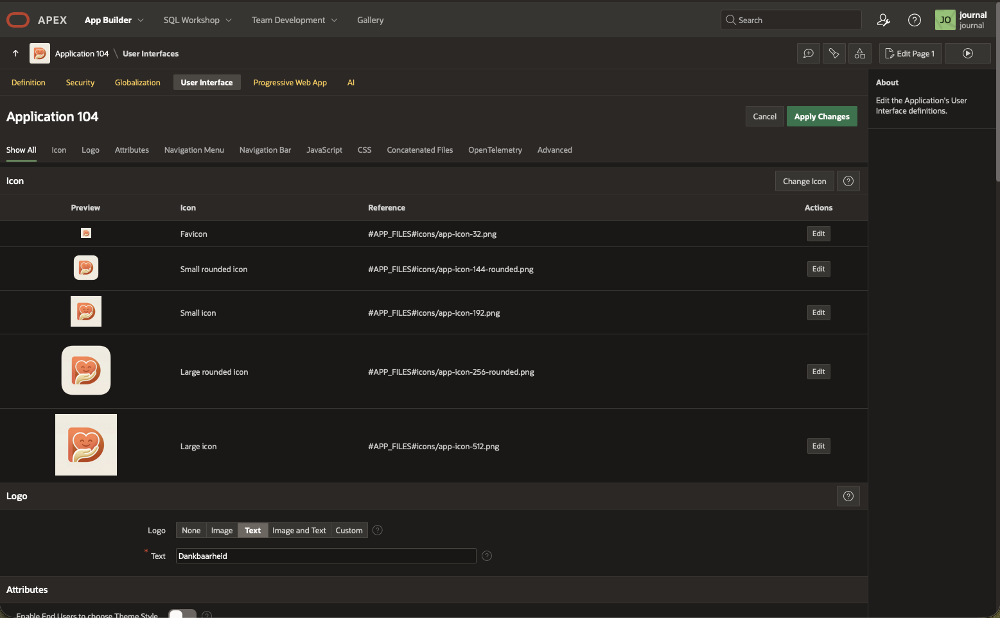

4. Click **Apply Changes**.

5. Run the application. You should now see an **Install App** option in the navigation bar (on supported browsers).

    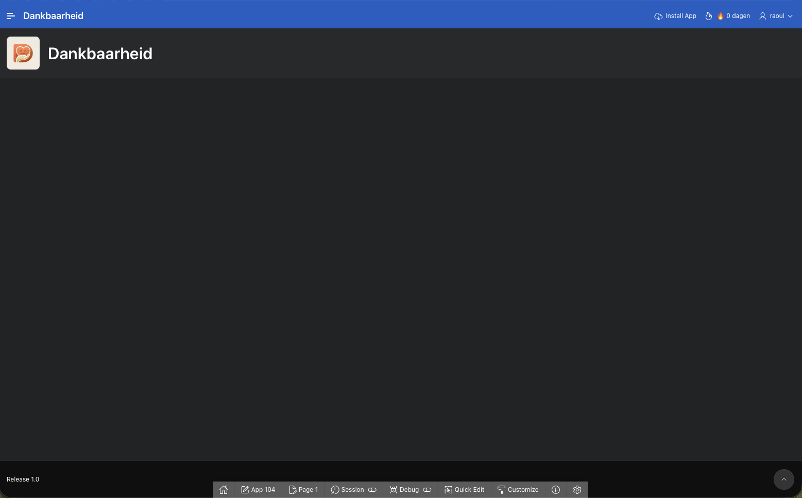

6. Test installation:
    - **On Desktop Chrome**: Click the install icon in the address bar or the "Install App" nav bar option
    - **On Android**: Open the app in Chrome → tap "Add to Home Screen" from the browser menu
    - **On iOS**: Open in Safari → tap Share → "Add to Home Screen"

    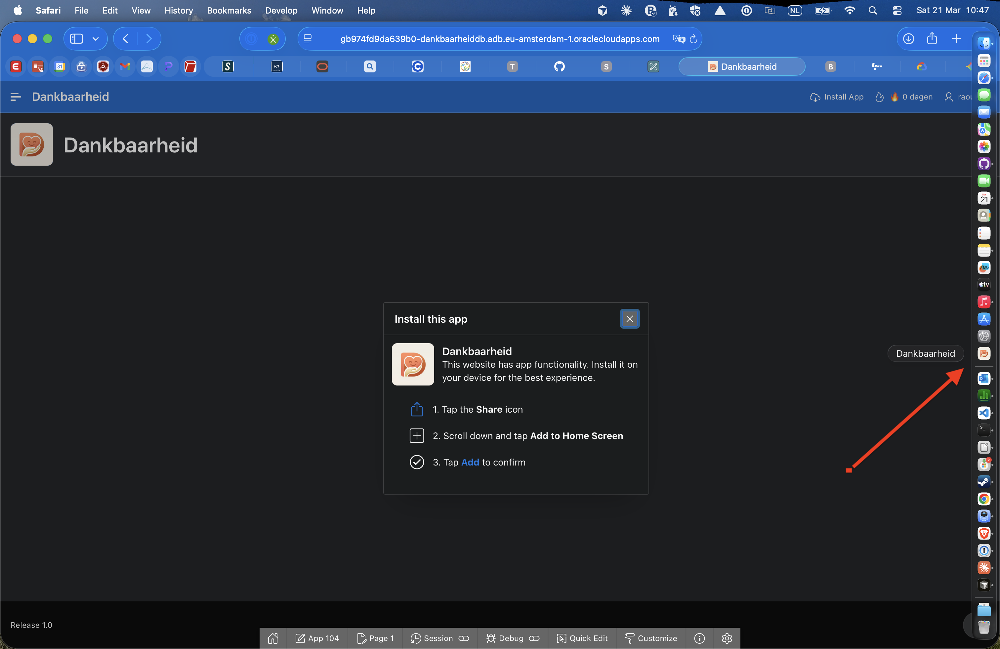

## Task 2: Enable Push Notifications

1. Go back to **Shared Components** → **Progressive Web App**.

2. Scroll down to the **Push Notifications** section and toggle it **On**.

    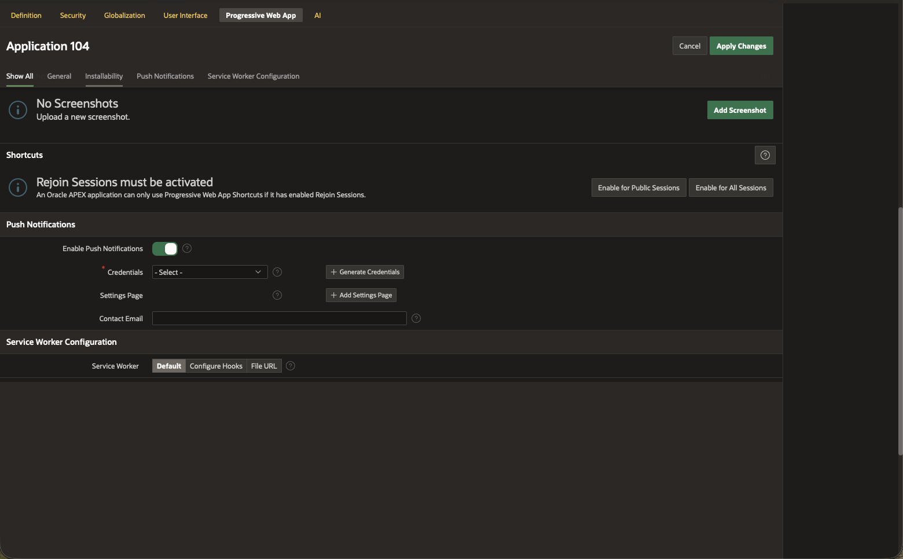

3. Click **Generate Credentials**. This creates a VAPID key pair (one-time setup) that APEX uses to authenticate with browser push services.

    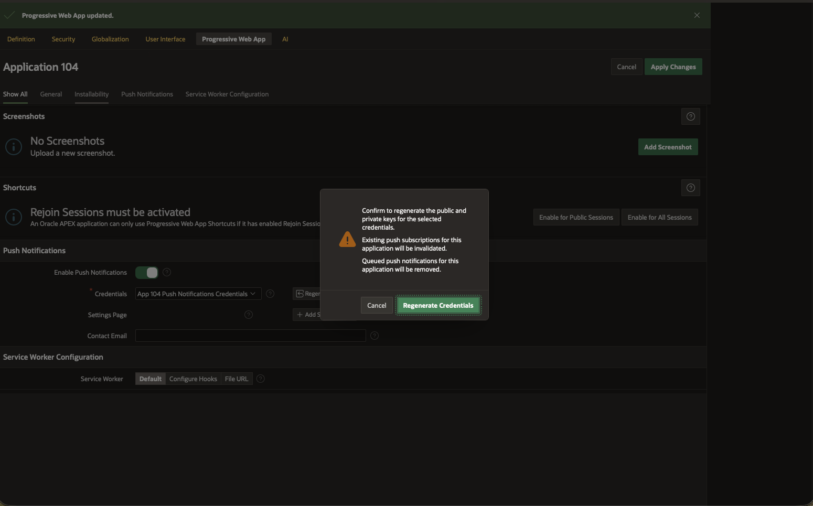

    > **Note:** VAPID (Voluntary Application Server Identification) keys allow APEX to send push notifications through Apple, Google, Microsoft, and Mozilla push relay services without any API keys or third-party accounts.

4. Click **+ Add Settings Page**. APEX automatically creates a settings page where users can opt in/out of notifications.

    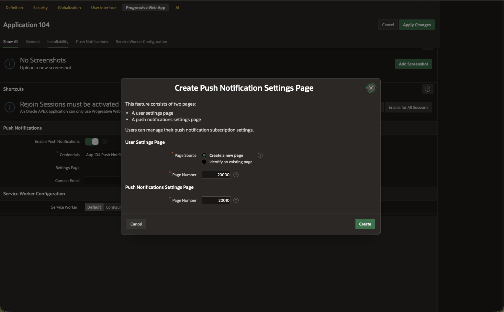

5. Note the **page number** of the auto-generated settings page (e.g., Page 40). We'll link to this from our settings page.

6. Click **Apply Changes**.

## Task 3: Link Notification Settings to Your App

1. Open **Page 30** (Instellingen) in Page Designer.

2. In the **Notificaties** section (or create one), add a button or link that navigates to the auto-generated push notification settings page:

    - Create a new **Static Content** region:
        - **Title**: `Notificaties`
        - **Source → HTML Code**:
        ```html
        <div class="notification-settings">
            <p><span class="fa fa-bell"></span> <strong>Dagelijkse reminder om 21:00</strong></p>
            <p style="color: #6B7280; font-size: 0.9rem;">
                Ontvang elke avond een herinnering om je dankbaarheid op te schrijven.
            </p>
            <a href="f?p=&APP_ID.:40:&SESSION." class="t-Button t-Button--warm" style="margin-top: 12px;">
                <span class="fa fa-cog"></span> Notificatie-instellingen beheren
            </a>
            <p style="color: #9CA3AF; font-size: 0.8rem; margin-top: 8px;">
                📱 Op iOS moet de app eerst op je startscherm staan (via Safari → Deel → Zet op beginscherm)
            </p>
        </div>
        ```

    > **Note:** Replace `40` with the actual page number of the auto-generated push notification settings page.

    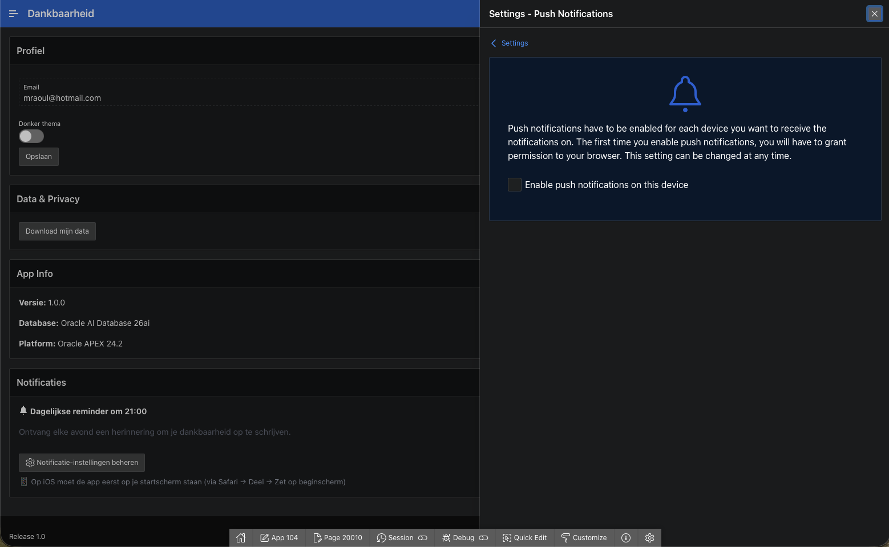

3. Click **Save**.

## Task 4: Schedule the Daily 21:00 Reminder

We'll use `DBMS_SCHEDULER` to send push notifications to all subscribed users every day at 21:00 Amsterdam time. The scheduler automatically handles Dutch daylight saving time (CET ↔ CEST).

1. Navigate to **SQL Workshop** → **SQL Commands**.

2. Run the following SQL to create the scheduled job:

    ```sql
    BEGIN
        DBMS_SCHEDULER.CREATE_JOB(
            job_name        => 'DAILY_GRATITUDE_REMINDER',
            job_type        => 'PLSQL_BLOCK',
            job_action      => q'[
                DECLARE
                    l_app_id CONSTANT NUMBER := 100;  -- Change to your Application ID!
                BEGIN
                    -- Create an APEX session context
                    -- (required for APEX_PWA calls outside of an APEX session)
                    apex_session.create_session(
                        p_app_id   => l_app_id,
                        p_page_id  => 1,
                        p_username => 'SCHEDULER'
                    );

                    -- Send notification to every subscribed user
                    FOR rec IN (
                        SELECT DISTINCT user_name
                        FROM   apex_appl_push_subscriptions
                        WHERE  application_id = l_app_id
                    ) LOOP
                        BEGIN
                            apex_pwa.send_push_notification(
                                p_application_id => l_app_id,
                                p_user_name      => rec.user_name,
                                p_title          => 'Tijd voor dankbaarheid 🙏',
                                p_body           => 'Neem even de tijd om na te denken over waar je dankbaar voor bent.'
                            );
                        EXCEPTION
                            WHEN OTHERS THEN
                                -- Log but continue with next user
                                apex_debug.error(
                                    'Push failed for user %s: %s',
                                    rec.user_name, SQLERRM
                                );
                        END;
                    END LOOP;

                    -- Flush the notification queue immediately
                    apex_pwa.push_queue;

                    -- Clean up the session
                    apex_session.delete_session;
                END;
            ]',
            start_date      => TO_TIMESTAMP_TZ(
                '2026-01-01 21:00:00 Europe/Amsterdam',
                'YYYY-MM-DD HH24:MI:SS TZR'
            ),
            repeat_interval => 'FREQ=DAILY; BYHOUR=21; BYMINUTE=0; BYSECOND=0',
            enabled         => TRUE,
            auto_drop       => FALSE,
            comments        => 'Daily gratitude reminder at 21:00 Amsterdam time (auto-handles DST)'
        );
    END;
    /
    ```

    > **Important:** Replace `100` with your actual APEX Application ID! You can find it in the App Builder URL or on the application home page.

    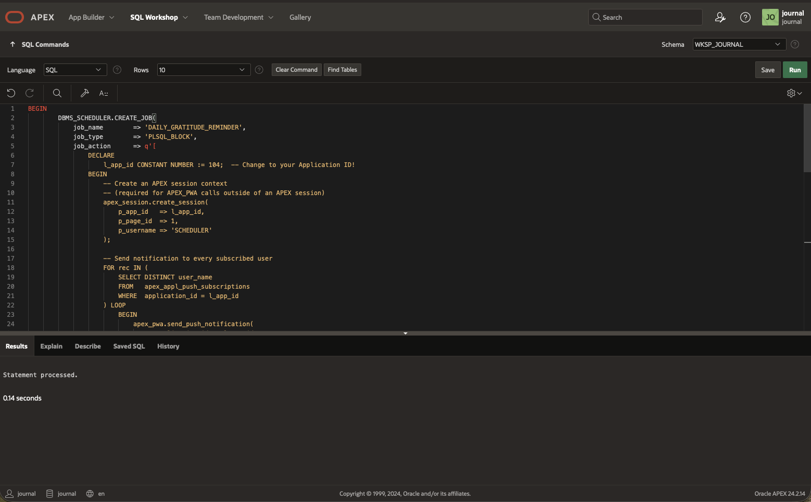

3. Verify the job was created:

    ```sql
    SELECT job_name, enabled, state, repeat_interval,
           TO_CHAR(next_run_date, 'YYYY-MM-DD HH24:MI:SS TZR') AS next_run
    FROM   user_scheduler_jobs
    WHERE  job_name = 'DAILY_GRATITUDE_REMINDER';
    ```

    You should see `ENABLED = TRUE` and `NEXT_RUN` showing the next 21:00 Amsterdam time.

    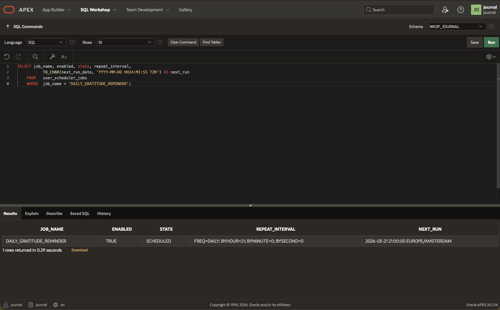

4. **Optional: Test the notification immediately** (without waiting for 21:00):

    ```sql
    BEGIN
        -- Manually run the scheduled job
        DBMS_SCHEDULER.RUN_JOB('DAILY_GRATITUDE_REMINDER');
    END;
    /
    ```

    If you have subscribed to push notifications in the app, you should receive a notification within 2 minutes (APEX processes the push queue periodically).

> **Note:** This scheduler job also serves an important secondary purpose: it keeps your Always Free database **active**, preventing the automatic shutdown that occurs after 7 days of inactivity. As long as this job runs daily, your database stays online.

## Task 5: Alternative — APEX Automations

Instead of `DBMS_SCHEDULER`, you can use **APEX Automations** for a more integrated approach. Automations manage the APEX session context automatically and include built-in execution logging.

1. Navigate to **Shared Components** → **Automations**.

    

2. Click **Create**.

3. Set the following:

    | Setting | Value |
    |---|---|
    | **Name** | `Daily Gratitude Reminder` |
    | **Type** | Scheduled |
    | **Execution Schedule** | Custom |
    | **Frequency** | Daily |
    | **Start Time** | `21:00` |
    | **Time Zone** | `Europe/Amsterdam` |

4. Under **Actions**, add a **Execute Code** action with:

    ```sql
    FOR rec IN (
        SELECT DISTINCT user_name
        FROM   apex_appl_push_subscriptions
        WHERE  application_id = :APP_ID
    ) LOOP
        BEGIN
            apex_pwa.send_push_notification(
                p_application_id => :APP_ID,
                p_user_name      => rec.user_name,
                p_title          => 'Tijd voor dankbaarheid 🙏',
                p_body           => 'Neem even de tijd om na te denken over waar je dankbaar voor bent.'
            );
        EXCEPTION
            WHEN OTHERS THEN NULL;
        END;
    END LOOP;

    apex_pwa.push_queue;
    ```

    

5. Toggle the automation to **Active** and click **Apply Changes**.

> **Note:** If you use APEX Automations, you don't need the `DBMS_SCHEDULER` job from Task 4. Choose one approach — the Automation is simpler but `DBMS_SCHEDULER` gives more control. For keeping the database awake, either approach works since both trigger a database session daily.

## Task 6: Test on Mobile Device

1. Open your APEX application URL on your smartphone's browser.

2. **Install the PWA:**
    - **Android (Chrome):** Tap the browser menu → "Add to Home Screen" or "Install app"
    - **iOS (Safari):** Tap Share button → "Add to Home Screen"

    

3. Open the installed app from your home screen. It should launch in **standalone mode** (no browser chrome — looks like a native app).

    

4. Navigate to **Instellingen** → **Notificatie-instellingen beheren**.

5. Enable push notifications when prompted by the browser.

    

6. Verify your subscription was registered:

    ```sql
    SELECT user_name, subscription_created_on
    FROM   apex_appl_push_subscriptions
    WHERE  application_id = 100;  -- Your app ID
    ```

    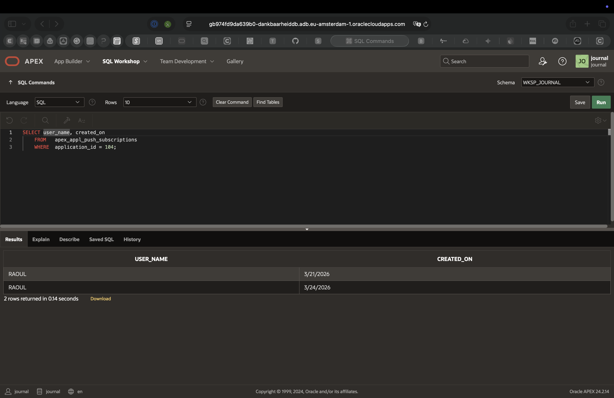

7. Test by manually triggering the job:

    ```sql
    BEGIN
        DBMS_SCHEDULER.RUN_JOB('DAILY_GRATITUDE_REMINDER');
    END;
    /
    ```

8. Within 2 minutes, you should receive a push notification on your phone.

    

9. Tap the notification — it should open the app to the daily question page.

> **iOS Note:** Push notifications on iOS **only work when the app is installed as a PWA** (added to home screen). The device must be running **iOS 16.4 or later**. Notifications do NOT work in the Safari browser directly.

Your app is now a fully functional PWA with daily push reminders! You may now **proceed to the next lab**.

## Acknowledgements

* **Author** - Raoul, Oracle APEX Developer
* **Last Updated By/Date** - Raoul, February 2026
