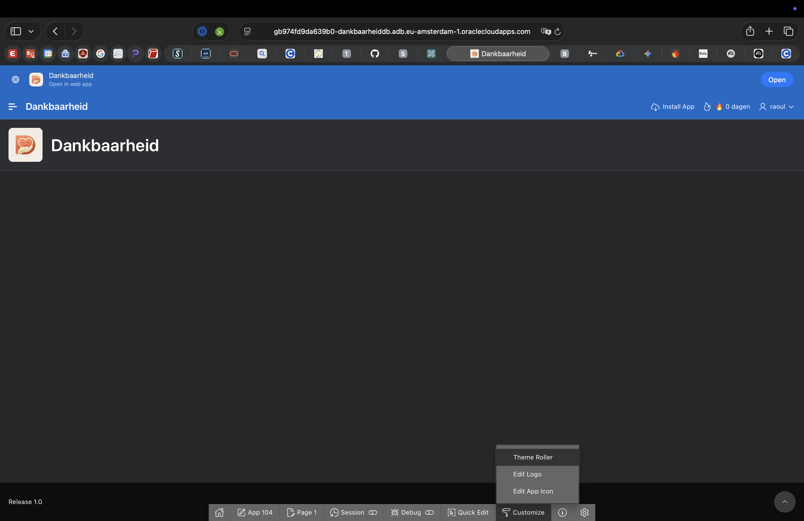
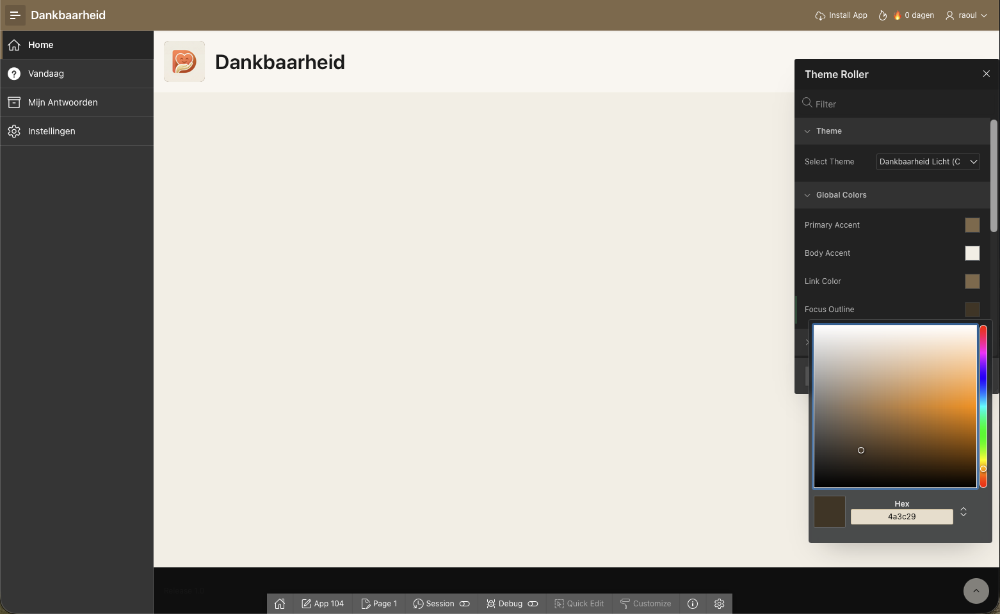
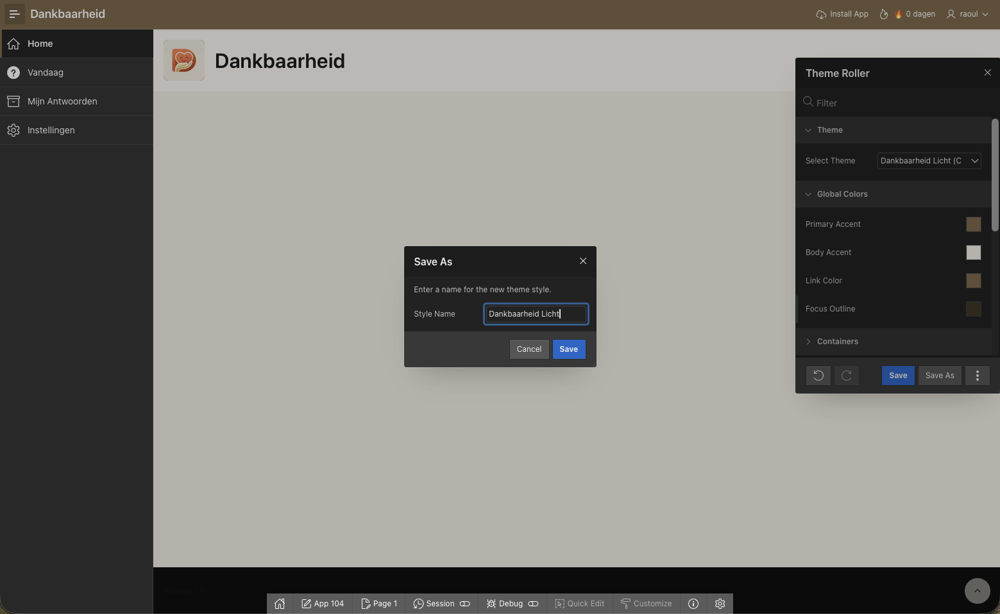
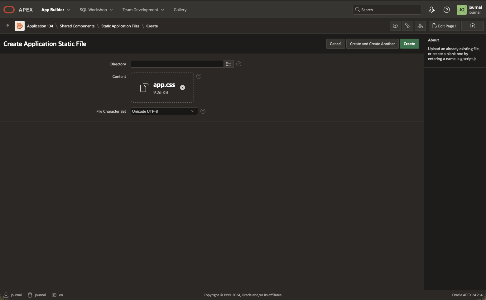
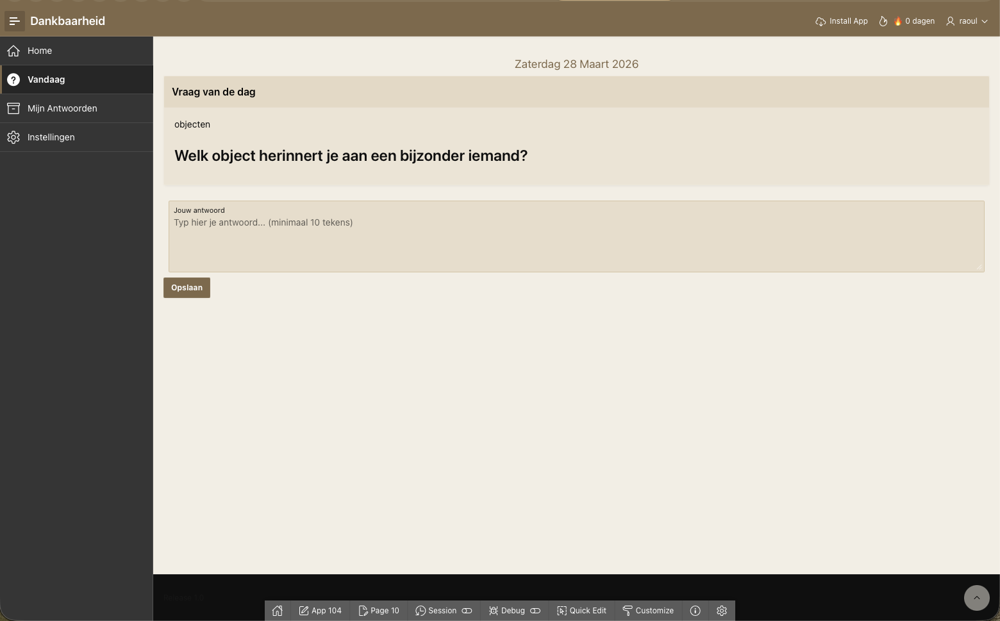
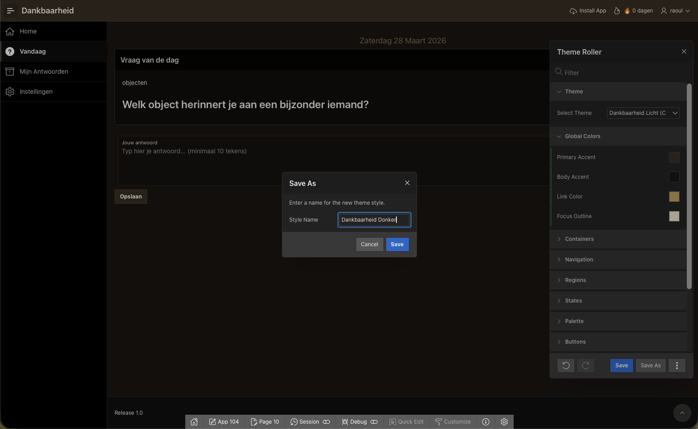

# Lab 6: Styling and Dark Mode

## Introduction

In this lab, you will transform the default APEX Universal Theme into a warm, inviting journaling interface. We'll configure Theme Roller for the light theme, write custom CSS for the gratitude journal aesthetic, create a dark theme variant, and implement a user-togglable dark mode that follows the OS preference by default.

Estimated Time: 35 minutes

### Objectives

In this lab, you will:
- Configure Theme Roller with warm cream/brown colors
- Write custom CSS for journal cards, the question page, and the login screen
- Create a dark theme variant using Theme Roller
- Implement dark mode toggle with OS preference detection
- Make the interface mobile-first and responsive

### Prerequisites

This lab assumes you have:
- Completed Lab 5 (working PWA with push notifications)
- Basic understanding of CSS (custom properties, media queries)

## Task 1: Configure Theme Roller (Light Theme)

1. Run your application and click the **Theme Roller** icon in the developer toolbar at the bottom of the page.

    

2. In Theme Roller, start with the **Vita** theme style as the base (it's more customizable than Redwood Light).

    > **Note:** If Vita is not available, choose Vita - Dark or any light base theme. The exact name may vary by APEX version.

3. Set the following Global Color values:

    | Setting | Value | Purpose |
    |---|---|---|
    | **Primary Accent** | `#8B7355` | Brown header |
    | **Body Accent** | `#F5F0E8` | Cream page background |
    | **Link Color** | `#8B7355` | Buttons, links |
    | **Body Title** | `#4A3C2A` | Heading text color |

    

4. Click **Save As** and name it `Dankbaarheid Licht`.

    

5. Close Theme Roller.

## Task 2: Upload Custom CSS

1. Navigate to **Shared Components** → **Static Application Files**.

2. Click **Create File** and load `app.css`.

3. Upload or paste the complete CSS below. This contains all styles for the gratitude journal:

    ```css
    /* ============================================
       DANKBAARHEID APP — Custom Styles
       ============================================ */

    /* ---------- CSS Custom Properties ---------- */
    :root {
        --gratitude-cream: #F5F0E8;
        --gratitude-cream-light: #FFFDF8;
        --gratitude-brown: #8B7355;
        --gratitude-brown-dark: #6B5B45;
        --gratitude-brown-darker: #4A3C2A;
        --gratitude-gold: #C4A265;
        --gratitude-warm-white: #FAF7F2;
        --gratitude-green: #059669;
        --gratitude-red: #EF4444;

        /* Override Universal Theme variables */
        --ut-body-background-color: var(--gratitude-cream);
        --ut-component-background-color: var(--gratitude-cream-light);
        --ut-component-text-default-color: var(--gratitude-brown-darker);
        --ut-palette-primary: var(--gratitude-brown);
        --ut-palette-primary-contrast: #FFFFFF;
    }

    /* ---------- Typography ---------- */
    body.t-PageBody {
        background-color: var(--gratitude-cream) !important;
        font-family: 'Georgia', 'Noto Serif', 'Times New Roman', serif;
        color: var(--gratitude-brown-darker);
        -webkit-font-smoothing: antialiased;
    }

    .t-Region-header h2,
    .t-Region-title {
        font-family: 'Georgia', serif;
        color: var(--gratitude-brown-darker);
    }

    /* ---------- Header ---------- */
    .t-Header {
        background-color: var(--gratitude-brown) !important;
        border-bottom: 3px solid var(--gratitude-gold);
    }

    .t-Header .t-Header-branding {
        color: #FFFFFF;
    }

    /* ---------- Navigation Bar ---------- */
    .t-NavigationBar .t-NavigationBar-item {
        color: rgba(255, 255, 255, 0.9);
    }

    /* ---------- Question Card ---------- */
    .question-card {
        background: var(--gratitude-cream-light);
        border: 1px solid rgba(139, 115, 85, 0.15);
        border-radius: 16px;
        padding: 32px 24px;
        margin: 16px 0;
        box-shadow: 0 4px 16px rgba(74, 60, 42, 0.08);
        text-align: center;
    }

    .question-text {
        font-family: 'Georgia', serif;
        font-size: 1.4rem;
        line-height: 1.6;
        color: var(--gratitude-brown-darker);
        font-weight: normal;
        margin: 16px 0 0;
    }

    .category-badge {
        display: inline-block;
        background: rgba(139, 115, 85, 0.1);
        color: var(--gratitude-brown);
        font-size: 0.75rem;
        font-family: -apple-system, BlinkMacSystemFont, sans-serif;
        text-transform: uppercase;
        letter-spacing: 0.05em;
        padding: 4px 12px;
        border-radius: 20px;
    }

    /* ---------- Journal Entry Textarea ---------- */
    .apex-item-textarea {
        min-height: 120px;
        font-family: 'Georgia', serif !important;
        font-size: 1rem;
        line-height: 1.8;
        background-color: var(--gratitude-warm-white) !important;
        border: 1px solid rgba(139, 115, 85, 0.25) !important;
        border-radius: 8px !important;
        padding: 16px !important;
        transition: border-color 0.2s, box-shadow 0.2s;
        resize: vertical;
    }

    .apex-item-textarea:focus {
        border-color: var(--gratitude-brown) !important;
        box-shadow: 0 0 0 3px rgba(139, 115, 85, 0.15) !important;
        outline: none;
    }

    /* ---------- Buttons ---------- */
    .t-Button--hot {
        --a-button-background-color: var(--gratitude-brown) !important;
        --a-button-text-color: #FFFFFF !important;
        border-radius: 24px !important;
        padding: 12px 32px !important;
        font-family: -apple-system, BlinkMacSystemFont, sans-serif;
        font-weight: 600;
        letter-spacing: 0.02em;
        transition: transform 0.15s, box-shadow 0.15s;
    }

    .t-Button--hot:hover {
        transform: translateY(-1px);
        box-shadow: 0 4px 12px rgba(139, 115, 85, 0.3);
    }

    .t-Button--warm {
        background-color: rgba(139, 115, 85, 0.1);
        color: var(--gratitude-brown-dark);
        border-radius: 20px;
        border: none;
        padding: 10px 20px;
    }

    /* ---------- Success Card ---------- */
    .success-card {
        background: var(--gratitude-cream-light);
        border: 1px solid rgba(5, 150, 105, 0.2);
        border-radius: 16px;
        padding: 32px 24px;
        margin: 16px 0;
        text-align: center;
    }

    .success-icon {
        font-size: 3rem;
        margin-bottom: 12px;
    }

    .success-card h2 {
        color: var(--gratitude-green);
        font-size: 1.2rem;
        margin-bottom: 20px;
    }

    .today-question {
        color: var(--gratitude-brown);
        font-style: italic;
        font-size: 0.9rem;
        margin-bottom: 12px;
    }

    .today-answer {
        background: var(--gratitude-warm-white);
        border-radius: 8px;
        padding: 16px;
        font-family: 'Georgia', serif;
        line-height: 1.7;
        margin-bottom: 20px;
        color: var(--gratitude-brown-darker);
    }

    /* ---------- History Cards ---------- */
    .a-CardView-item {
        background: var(--gratitude-cream-light) !important;
        border: 1px solid rgba(139, 115, 85, 0.12);
        border-radius: 16px !important;
        box-shadow: 0 4px 12px rgba(74, 60, 42, 0.06);
        transition: transform 0.2s ease, box-shadow 0.2s ease;
        margin-bottom: 12px !important;
    }

    .a-CardView-item:hover {
        transform: translateY(-2px);
        box-shadow: 0 8px 24px rgba(74, 60, 42, 0.12);
    }

    .a-CardView-body {
        font-family: 'Georgia', serif;
        line-height: 1.7;
    }

    /* ---------- Stats Bar ---------- */
    .stats-bar {
        display: flex;
        justify-content: center;
        gap: 24px;
        padding: 16px;
        margin-bottom: 16px;
    }

    .stat {
        color: var(--gratitude-brown);
        font-family: -apple-system, BlinkMacSystemFont, sans-serif;
        font-size: 0.9rem;
    }

    .stat strong {
        color: var(--gratitude-brown-darker);
        font-size: 1.1rem;
    }

    /* ---------- Date Header ---------- */
    .date-header {
        font-family: -apple-system, BlinkMacSystemFont, sans-serif;
    }

    /* ---------- Login Page ---------- */
    .t-Login-body {
        background: linear-gradient(160deg, var(--gratitude-cream) 0%, #EDE5D8 100%) !important;
    }

    .t-Login-container {
        background: var(--gratitude-cream-light) !important;
        border-radius: 20px !important;
        box-shadow: 0 8px 32px rgba(74, 60, 42, 0.12) !important;
        border: 1px solid rgba(139, 115, 85, 0.1);
    }

    .t-Login-logo {
        color: var(--gratitude-brown);
    }

    /* ---------- Duplicate Error Banner (from Lab 4) ---------- */
    .dup-error-banner {
        background-color: #FEF2F2;
        border-left: 4px solid var(--gratitude-red);
        border-radius: 8px;
        padding: 16px;
        margin-bottom: 16px;
        animation: slideDown 0.3s ease-out;
    }

    @keyframes slideDown {
        from { opacity: 0; transform: translateY(-10px); }
        to   { opacity: 1; transform: translateY(0); }
    }

    .dup-error-icon {
        display: inline-block;
        width: 24px; height: 24px;
        background: var(--gratitude-red);
        color: white;
        border-radius: 50%;
        text-align: center;
        line-height: 24px;
        font-size: 14px; font-weight: bold;
        margin-right: 8px;
        vertical-align: middle;
    }

    .dup-error-msg {
        display: inline;
        color: #991B1B;
        font-weight: 600;
    }

    .dup-error-details { margin-top: 12px; }
    .dup-error-details summary {
        cursor: pointer;
        color: #6B7280;
        font-size: 0.85rem;
    }

    .dup-prev-text {
        background: #F3F4F6;
        border-radius: 6px;
        padding: 12px;
        margin-top: 8px;
        font-style: italic;
        color: #6B7280;
        font-size: 0.9rem;
        line-height: 1.6;
    }

    .dup-error-tip {
        margin-top: 12px;
        color: #92400E;
        font-size: 0.85rem;
        background: #FFFBEB;
        padding: 8px 12px;
        border-radius: 6px;
    }

    /* ---------- Character Counter ---------- */
    .char-feedback {
        font-size: 0.8rem;
        font-family: -apple-system, BlinkMacSystemFont, sans-serif;
        padding: 4px 0;
        transition: color 0.2s;
    }
    .char-feedback--warning { color: #9CA3AF; }
    .char-feedback--ready   { color: var(--gratitude-green); font-weight: 500; }

    /* ---------- Mobile Responsive ---------- */
    @media (max-width: 640px) {
        .question-text {
            font-size: 1.2rem;
        }

        .question-card,
        .success-card {
            padding: 24px 16px;
            margin: 8px 0;
        }

        .stats-bar {
            flex-direction: column;
            align-items: center;
            gap: 8px;
        }
    }

    /* Center main content for desktop */
    @media (min-width: 768px) {
        .t-Body-content {
            max-width: 640px;
            margin: 0 auto;
        }
    }

    /* ---------- App Info Section ---------- */
    .app-info {
        color: #9CA3AF;
        font-size: 0.85rem;
        font-family: -apple-system, BlinkMacSystemFont, sans-serif;
    }
    .app-info p { margin: 4px 0; }

    /* ---------- Notification Settings ---------- */
    .notification-settings {
        padding: 4px 0;
    }
    ```

    

4. Ensure the CSS file reference is in **Shared Components** → **User Interface Attributes** → **CSS → File URLs**:

    ```
    #APP_FILES#app#MIN#.css
    ```

5. Run the application and verify the styling:

    

## Task 3: Create the Dark Theme

1. Run the application and open **Theme Roller** again.

2. Start by duplicating the current light theme. Set these dark-mode colors:

    | Setting | Value |
    |---|---|
    | **Primary Accent** | `#3D3225` |
    | **Body Accent** | `#1A1410` |
    | **Link Color** | `#C4A265` (gold for dark mode) |
    | **Focus Outline** | `#E8DCC8` |

3. Click **Save As** and name it `Dankbaarheid Donker`.

    

## Task 4: Implement Dark Mode Toggle

We'll implement dark mode that: (a) follows the OS preference by default, (b) can be overridden by the user, and (c) persists the user's choice.

1. Create an **Application Item** `P0_DARK_MODE`:
    - Navigate to **Shared Components** → **Application Items**
    - Click **Create**
    - **Name**: `P0_DARK_MODE`
    - **Session State Protection**: Unrestricted

2. Create an **Application Process** to set the dark mode preference on load:
    - **Name**: `Set Dark Mode Pref`
    - **Point**: On Load: Before Header
    - **PL/SQL**:
    ```sql
    DECLARE
    l_dark_mode CHAR(1);
    BEGIN
        SELECT dark_mode
        INTO   l_dark_mode
        FROM   app_users
        WHERE  UPPER(username) = UPPER(V('APP_USER'));

        :P0_DARK_MODE := l_dark_mode;

        apex_theme.set_session_style(
            p_theme_number => 42,
            p_name => CASE l_dark_mode 
                        WHEN 'Y' THEN 'Dankbaarheid Donker' 
                        ELSE 'Dankbaarheid Licht' 
                    END
        );
    EXCEPTION
        WHEN NO_DATA_FOUND THEN
            :P0_DARK_MODE := 'N';
    END;
    ```

3. On the Settings page (Page 30), add a **Dynamic Action** on the dark mode switch (`P30_DARK_MODE`) change event:
    - **Event**: Change
    - **True Action 1**: Execute Server-side Code (PL/SQL):
    ```sql
    DECLARE
    l_user_id NUMBER;
    BEGIN
        l_user_id := pkg_journal.get_current_user_id;
        
        UPDATE app_users
        SET    dark_mode = :P30_DARK_MODE
        WHERE  user_id = l_user_id;
        
        :P0_DARK_MODE := :P30_DARK_MODE;
        
        apex_theme.set_session_style(
            p_theme_number => 42,
            p_name => CASE :P30_DARK_MODE 
                        WHEN 'Y' THEN 'Dankbaarheid Donker' 
                        ELSE 'Dankbaarheid Licht' 
                    END
        );
    END;
    ```
    - **Items to Submit**: `P30_DARK_MODE`
    - **True Action 2**: Execute JavaScript:
    ```javascript
    apex.page.reload();
    ```

4. Add dark-mode-specific CSS overrides to `app.css`:

    ```css
    /* ---------- Dark Mode Overrides ---------- */
    /* These apply when the 'Dankbaarheid Donker' theme style is active */
    body.t-PageBody--dark,
    body[data-theme-style*="Donker"] {
        --gratitude-cream: #1A1410;
        --gratitude-cream-light: #2A221A;
        --gratitude-brown: #C4A265;
        --gratitude-brown-dark: #D4B275;
        --gratitude-brown-darker: #E8DCC8;
        --gratitude-warm-white: #2A221A;
    }
    ```

    > **Note:** The exact CSS selector for dark mode depends on how APEX renders the theme style. You may need to inspect the `<body>` tag's classes when the dark theme is active and adjust the selector accordingly.

5. Run the application, go to **Instellingen**, and toggle the dark mode switch.

    

## Task 5: Verify Mobile Responsiveness

1. Open your application on a mobile device (or use Chrome DevTools → Device Toolbar).

2. Check these views at **375px width** (iPhone SE):

    - [ ] Login page renders cleanly with centered form
    - [ ] Daily question page: question card is full-width, textarea fills the screen width
    - [ ] Submit button is full-width and touch-friendly (min 48px height)
    - [ ] History cards stack vertically with proper spacing
    - [ ] Settings page sections stack properly
    - [ ] Navigation bar is usable without horizontal scrolling

3. Check at **768px width** (tablet):

    - [ ] Content is centered with a max-width
    - [ ] Cards have comfortable spacing
    - [ ] Forms don't stretch to full width

4. Check at **1024px+** (desktop):

    - [ ] Main content is centered at max 640px width
    - [ ] History cards don't stretch too wide
    - [ ] Clean, focused reading experience

Your app now has a beautiful, warm journaling interface with dark mode support!

## Acknowledgements

* **Author** - Raoul, Oracle APEX Developer
* **Last Updated By/Date** - Raoul, February 2026
